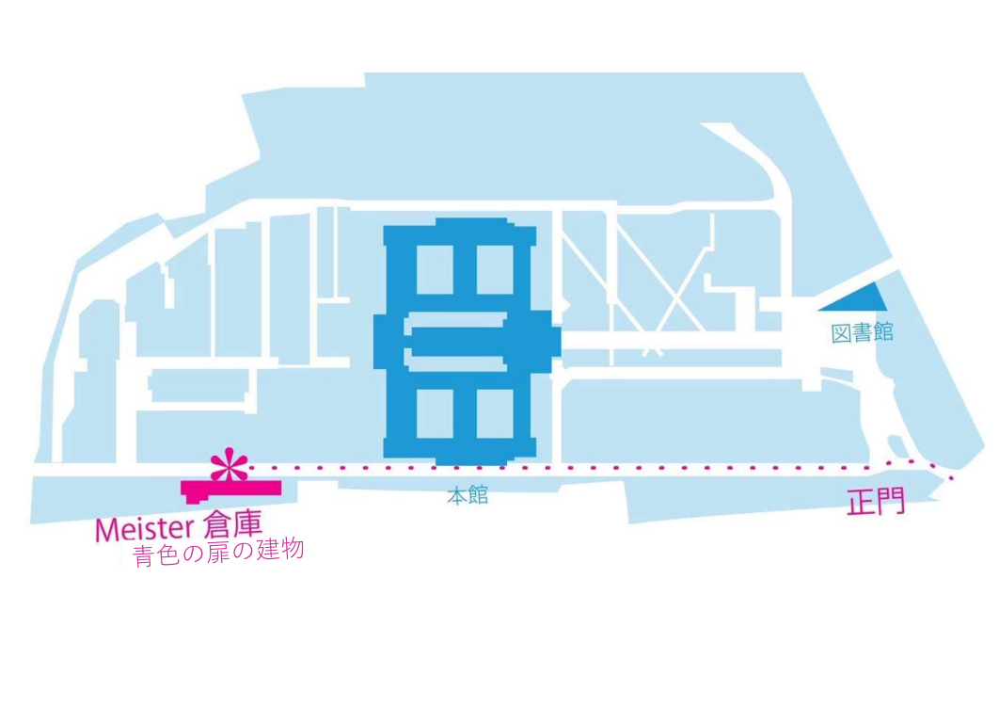

大岡山駅から東工大の正門に入り、左の道路に入って5分ほど歩くと、セブンイレブンの真向かいに青い扉があります。 この青い扉がMeisterの活動場所(倉庫)です。Meisterに興味のある方、質問のある方、是非見学に来て下さい！

直接活動場所に来ていただいても大丈夫ですが、部員がいないこともあるため、できるだけ事前に連絡先([Twitter](https://twitter.com/titech_meister)、[LINE](https://liff.line.me/1645278921-kWRPP32q/?accountId=722fzwlk)、[掲示板]()のいずれか )まで連絡をしてください。