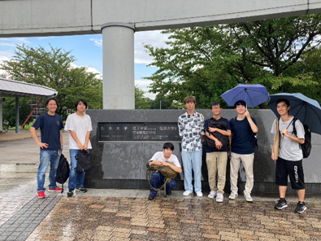

こんにちは。24代Meisterです！
24代というのは2024年度に完成した人力飛行機の機体を飛ばす代のことを表していて、主に大学二年生のMeister部員が相当します。自分たちの機体を琵琶湖で飛ばすために日々後輩とともに製作にいそしんでいます。
このブログも長らく更新がされていませんでしたが、Meisterの活動を知ってもらう場として今後、毎月更新をしていく予定なので気が向いたときにぜひご覧に来てください！

今回は24代が執行代(翌年に機体を飛ばす代)になってからの夏休み期間(８月～10月)での活動をまとめさせてもらいました！
目次は以下のようになっています。
Meisterは翼班・Pフレーム班・電操班・ペラ班・駆動班・フェアリング班に分かれて製作をしていますが、このブログでは毎月交代で班一つの活動をピックアップしてお伝えします！今回はMeisterの機体の翼を作っている翼班です！

## 1. 機体についての報告

24代の機体は去年までの片持ち機から路線を変えてリアスパを導入することになりました。リアスパを導入する目的は以下の通りです。

1. Meisterの二次構造は、ほとんどのチームで採用されている強化部材がなかったり、肉抜きを攻めていたりしていて剛性が低く、リアスパがあればリブを2点固定できるため、主桁-リアスパ間においてMeisterの伝統である攻めた肉抜きを維持したまま剛性も確保できます。
今年導入する後縁のバルサによる強化部材もリアスパを支点にすることでよりその効果を増します。
1. リアスパは構造的に効率の良い構造で、主桁に全周積層を入れるよりも比剛性が高くなります。初年度なのであまり強度を攻めはしませんが、引き継いでいけば長期的にはより重量を減らすことが出来ると考えられます。
1. 翼翼接合の再現性がフランジより高く精度が上がり、楽に接合できるためTFの運用性が改善する。

Meisterとしては初の試みになるので、OBの方々をはじめ、他チームの方々、情報提供などをしていただけると助かります。初の挑戦ですがMeisterのモットーである「change＆creation」を心に刻み邁進してまいりますので応援よろしくお願いします！

## 2. 夏休み期間の全体としての活動報告

大学生の夏休みは長いですが、多くの鳥人間サークルと同様にMeisterも部員が作業場に頻繁に来ていたことにより、休みだが学校にほとんどいるといった日々を過ごしていました。今回ピックアップして書かせてもらったイベントのほかにもOB方との交流会や部員のほとんどが駆り出される桁巻きも行いました、ご協力してくださったOBの方々ありがとうございました！

### 代替わり大掃除

代が変わるタイミングで倉庫がとてつもなく汚かったのと、一応昨年度も行ったようなので大掃除を行いました。ただ汚いところを磨くだけでなく、作業場のレイアウトも変えて無駄なものを新しく借りた倉庫に移動したり、捨てたりしてとてもきれいになりました！また汚くならないように、毎日の作業の後の掃除を徹底しており、作業場の管理をしてくれている先生にも「きれいにしていていいね！」とよく言ってもらえるようになりました！OBの方々をはじめ、ぜひきれいになった作業場を見に来てください！

    

        </img>
        Before
    

    

        </img>
        After
    

### HPA交流会、他大学見学

夏休み期間中に人力飛行機サークルの交流会であるHPA交流会に参加してきました。お世話になっている方のご講義もあり、とても参考になるお話をたくさんできました。
　　他大学見学もさせていただき、個人でのTF見学を除けば二つの大学に見学に行かせていただきました。東京都立大学鳥人間部T-MITと日本大学理工学部航空研究会NASGさんに見学に行かせていただきました！T-MITさんとはその後、翼の製作に使うフィルムの交換もさせていただきました。Meisterに見学に来てくださった他チームの皆さんも含めこれからもよろしくお願いします！

### 決起集会、全体MTG

8/30に24,25代の決起集会を開いて、各部員の決意表明,安全講習会,勉強会,機体名の案だしを行い決意新たに機体の製作へと一丸となって向かうための準備を行いました。
　24代の本番での目標も再確認しました。24代の本番での大きな目標は、今まで一度も旋回を成功させていないことから、一つ目の大きな壁である第一旋回ポイントの
“旋回を成功させる”ということです。Meister初の旋回成功のために日々努力をしていきます！
この機会では機体名は決定しませんでしたが、その後話し合いを重ねてついに9/28に機体名が決定しました！

24代の機体名は…
<h1 class="text-center">「玄鳥」</h1>
です！！！

</img>

読み方は「つばめ」で、東京工業大学のシンボルマークにもあやかっています。
東京工業大学は来年度から東京医科歯科大学と統合するため、つばめのシンボルマークが独自のものとして扱われるのは今年が最後になります。最後の「つばめ」として琵琶湖の空を飛びたいという思いと、つばめには帰巣本能があって今年の目標である”旋回成功”と重なっているという考えのもと決定しました。機体名を決めるにあたって「Exceed」という機体名も先輩方からの思いを引き継ぎ、苦境を乗り越えて目標を達成するという意味を持たせていて人気でした。この思いも胸に本番に向けて一丸となって頑張っていきます！

## 3. 翼班の日々

夏休みは主に試験翼の製作を行いました。後半は本番翼のリブ切りにも入って、25代の協力もあって順調に進んでおります！

　24代の翼はリアスパ機になることで製作順序や工程、注意点が増加したので試験翼を用いた考察を丁寧に行う必要性が特にありました。また、去年よりも熱収縮をするフィルムを採用すべく、様々なフィルムと収縮による翼の二次構造の変形実験も行いました。
以下活動をまとめました。
### 【試験翼でやったこと】 

#### 様々なフィルムの試し張り 

- teamF使用のフィルム・・・ 想像の数倍収縮する。80度で十分にしわがとれるくらい収縮するが９０度以上の熱を近づけるとしわくちゃになってしまった。扱いが難しそう 
- あざみ野使用のフィルム・・・ 熱により接着するため両面テープはいらないが貼り方が難しい。一度剥がれてしまうと再度熱を当てても接着しないため慣れないうちは大量に没になる気がする 
- 信越フィルム・・・８０度でもきれいに収縮してくれるが１００度で収縮させるともっときれいになる。イ
チオシ。また今度試してみる予定。
- トレファン・・・全然熱収縮しない。ある程度キレイにフィルムを貼れればきれいになる程度。
- ボローレ・・・とても収縮する。８０度でしわが完全になくなるほどきれいになったが温度を上げてい
くとフィルムテンションに耐えられなくなったリブが破壊される。

#### ストリンガー 
１４代ではストリンガーを速乾クリアで作っていたことから試しに速乾クリアでストリンガーを製作したところゴミができた。速乾クリアの塗り方は３パターン試した。 

- 速乾クリアをカーボンとスタイロ両方に塗ったVer・・・
塗った速乾クリアのムラが２倍になるためくっついているところは速乾クリアが大量についているが全然ついていないところもちらほら。一番ひどかった。 
- カーボンだけに塗ったVer・・・
二番目にひどかった。ムラはひどかったが上記のものよりまし 
- スタイロだけに塗ったVer・・・
一番まし。ムラが一番少なかった。ムラがないようにキレイに塗れば使えないことはないかも。３ｍｍ厚に切ったときも上の２つよりもはがれていなかった。 

速乾クリアを使ったものはすべてスプレー糊を使ったものよりも柔らかく剛性がなかったうえ手間がかかる。 

「結果」 

<h6 class="text-center">ストリンガーはスプレー糊で作るべき </h6>

#### マスター 

今年からあざみ野をリスペクトしてt2.5のMDFマスターを導入。十字線合わせはやりづらくなったがリブ切りがしやすくなり、またゴールデンボードよりもたわみにくいため扱いが多少雑でも耐えるようになったため扱いやすくなった。また今年の試験翼は翼弦長が1080mmを超えており大学に設置されたレーザ加工機に収まらないためストリンガーの穴をうまく活用し分割して切った。接着には東北大学らしいダイソーの瞬間協力接着剤を使用した。接着の仕方にはまだ改善の余地があるので模索していく。MDFマスターの切り出しは今まで使用していたゴールデンボードの２倍時間がかかる。 

#### 後縁板 
他大で使用されている後縁にバルサ等を貼るのを試しにやってみることに。１㎜アクリル板、１㎜バルサ、２㎜バルサで試してみたところいずれも後縁の強度は増した。今のところ１㎜バルサを本番翼で使う予定。接着はスチノリor速乾クリア。スプレー糊は微妙。１㎜アクリル板は１つ３ｇと重かった。 

#### リアスパ、ブレーシングワイヤー 
主翼の二次構造の作り方はあまり変わらない。製作よりもp-フレーム班との干渉を考えてうまく予定を立てることの方が重要装。ブレーシングワイヤーについてワイヤーをはるのに気持ち大きめのターンバックルを用いるのが良さそう。２本同時に張るべき。ワイヤーの張り方はわからないことだらけなので引き続き情報収集 

#### 極限肉抜きリブ 
プランクを貼るときの荷重で折れた。プランクを貼るときにリブの剛性がなくなるため（ちょっと押すと簡単に動いてしまう）作業がしにくい。見た目はかっこいい。 

#### その他 
リブの後縁部分をカットせず後縁材をひとつなぎで作ろうとしたがリブ後縁の切り方がバラバラなのでやめた 

### 【本番翼について】 
本番翼はABのマスターをMDFで、CDのマスターをゴールデンボードで作る予定。ABは矩形のため同じマスターを何度も使用することから変形しにくいMDFを使う方がいいと判断。CDは最低２回以下使わないのでコスパと製作時間の関係からゴールデンボードを使用。十字線合わせは今までの通り厳しくチェックするがリブ切りはめちゃくちゃ×10くらい精度を落とした。（スタイロフォームが石油製品故お値段が高く無駄にできない＆リブ切の精度を出そうが二次構造を精密に作らなければ意味がないためリブ切よりも二次構造に時間をかけたいという意図）（正直なぜMeisterはリブ立てを重力式とかいう不確実要素の多い方法でやっているのにリブ切の精度に厳しかったのか謎） 
十字線合わせのチェックの基準としては 
- 浮いた場合→やすって凹凸がなくなればOK 
- 止まった場合→電熱線の跡が一本分つく程度であればＯＫ。
あまりにもへこみが大きい場合は没 
- 切り口が斜めになってしまった場合→1mmいかならＯＫ。それよりひどければ没

製作面の詳しいお話も書かせていただきました。何かアドバイスなどありましたら下にまとめてある連絡ツールによろしくお願いします！

Twitter <i class="bi-twitter"></i>：[@titech_meister](https://twitter.com/titech_meister)

Instagram <i class="bi-instagram"></i>：[@tokyotechmeister](https://instagram.com/tokyotechmeister)

掲示板 <i class="bi-bbs"></i>：[https://meister.ne.jp/bbs/](https://meister.ne.jp/bbs/index.rb)

## 4. まとめ

ここまでご覧いただきありがとうございました。Meisterの活動はこれからも続いていきますので繰り返しになりますが応援のほどよろしくお願いいたします。