
こんにちは。24代Meisterです！

10月下旬から12月初旬の活動報告の投稿の中に、フェアリング設計が落ち着いたことから、フェアリング班をピックアップした「フェアリング班の日々」を書かせていただきましたが、フェアリング班の誇るフェアリング設計士がかなり詳しく書いてくれたころもあり別投稿としてまとめることになりました。
お時間ありましたら是非読んでいただけると幸いです。

目次
<!-- @import "[TOC]" {cmd="toc" depthFrom=1 depthTo=6 orderedList=true} -->

<!-- code_chunk_output -->

1. [概略](#概略)
    1. [step1. Fusion360での準備](#step1-fusion360での準備)
    2. [step2.平面作成](#step2平面作成)
2. [実際に起こったトラブルとその対処方法](#実際に起こったトラブルとその対処方法)
    1. [その①](#その1)
    2. [その②](#その2)
    3. [成功例](#成功例)

<!-- /code_chunk_output -->

こんにちは。Meister24代、フェアリング班設計士の者です。公の場（？）で発信するのはTwitterで今年の設計について書いた時以来です。（それ以外は他の人が書いてくれています。）

さて、今回はフェアリングの治具設計について書こうと思います。我々は治具設計にはsolidworksを用いています。どういう考えの下で治具データを作成しているかを書きたいと思います。

＜お話の前提＞
- 私たちMeisterのフェアリング班では、まず発泡スチロールのブロックを作成してその面にピッタリ合う四角い「治具のシート」を貼り付け、電熱線でカット＋やすり掛けを行っています。
- 治具はプリンターで印刷していて、その関係からデータとしてはA０サイズで治具を作成し、それより少し小さいサイズで印刷しています。
- Fusion360の部品データで厚み形成して治具を作る場合は断面も「エンティティ変換（後述）」すると上手くいきますが、2024年度の機体は厚み形成出来なかったため中身が詰まった状態のものを作成し、オフセットを上手くとって治具を作成しました。

# 概略
　治具のpdfデータはsolidworksの「図面作成」機能を用いて作っています。これを読まれる方が必ずしも機械工学を専攻していたり、3DCADに慣れていたりするとは限らないので少し補足しようと思います。

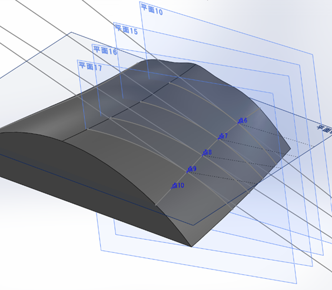

3DCADはこういうヤツです！3DCADでは3Dのグラフィックと睨めっこしながら作業します。では、作った部品を工場に外注することを想像してください。このグラフィックを見せられても「分からんわ！」と一喝されて加工してもらえない（？）かもしれません。
こんな時のために三面図があります。三面図、というと鳥コンの書類審査でもあるものですね。この三面図、機械工学を専攻すると製図の授業でいやというほど叩き込まれます。これを、3Dデータから（ほぼ）自動で書く機能が各3DCADソフトには備わっており、これがsolidworksでいう「図面を作成」になります。
本来の用途とは少し異なった形で（悪用？）この「図面を作成」を用いて3Dデータから治具のデータ（pdf）を作成します。本来想定されていないことを目的としているため、少し特殊な操作を要しますが、慣れれば簡単です。
なお、私が使用しているsolidworksのバージョンは2022-2023です。

## step1. Fusion360での準備
　分割した部品と、それを覆う直方体をFusion360上で用意します。ここで作る直方体が部品を切り出す時に必要なブロックとなります。この操作を行う理由は、①実際に部品を作成するために必要なブロックのサイズを決定するため②治具の
ファイル→エクスポートから、この状態のものを stepファイル 形式でエクスポートし自分のpcに保存します。

## step2.平面作成

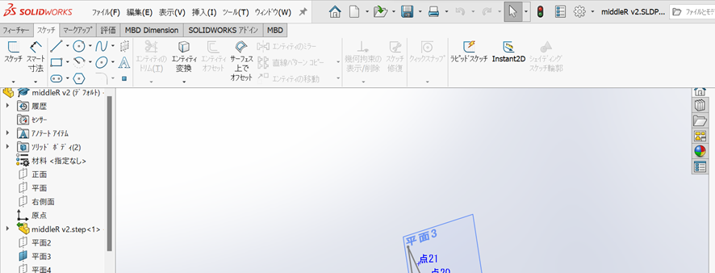

ブロックの各面にスケッチ用の平面を作成します。平面の構築は「フィーチャー>>参照ジオメトリ＞＞平面」から行います。

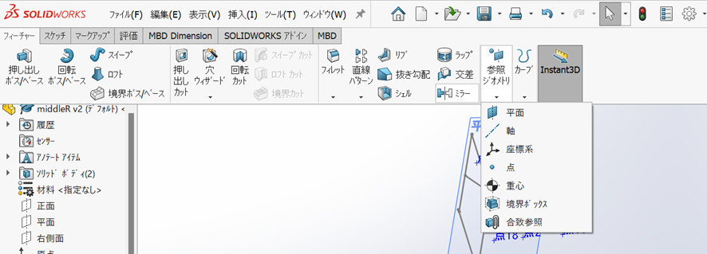

もしくは「挿入>>参照ジオメトリ＞＞平面」からも平面を作成できます。

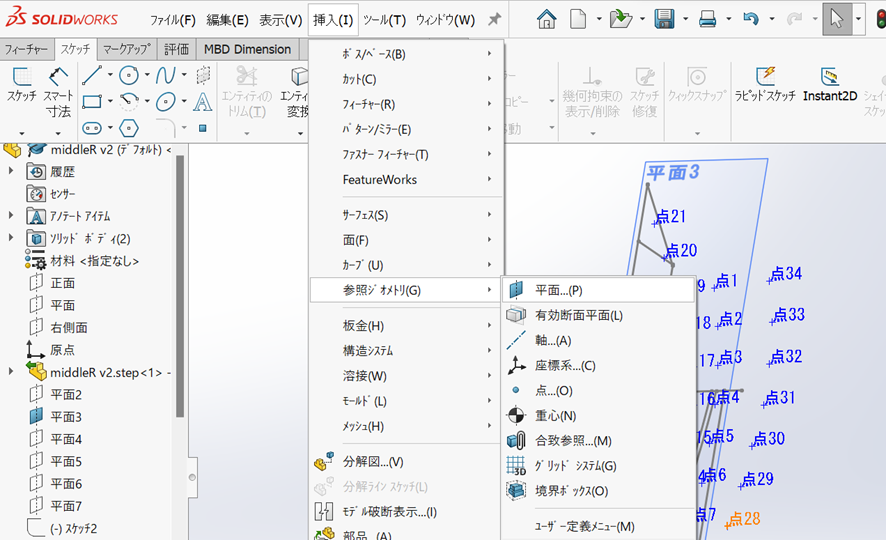

平面挿入時にはデフォでオフセット10mmがついているので0mmに変更します。

次に平面をクリックして選択した上で「スケッチ>>スケッチ」を選択してスケッチを開始します。

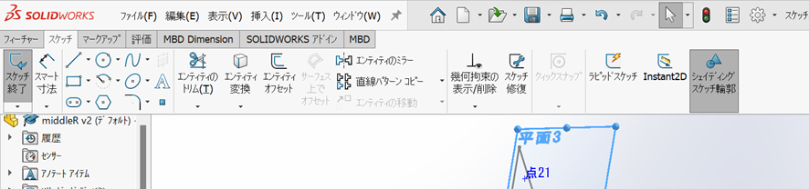

（スケッチ中はメニューバーが少し変わるのでそこで見分けます）

ここからは「エンティティ変換」を多用することになります。エンティティ変換はCAD上のソリッド（パーツ）の輪郭や繋ぎ目などをスケッチ平面に投影してくれる機能です。この機能はかなり重宝していますがsolidworks特有のものなのか、他のCADソフトではみたことがなく、特にシルエットの投影はFusion360では（僕の知る限り）あまり上手くいきませんでした。
　
さて、治具作成においてはまずブロックの輪郭を描画するためにブロックの面をエンティティ変換します。

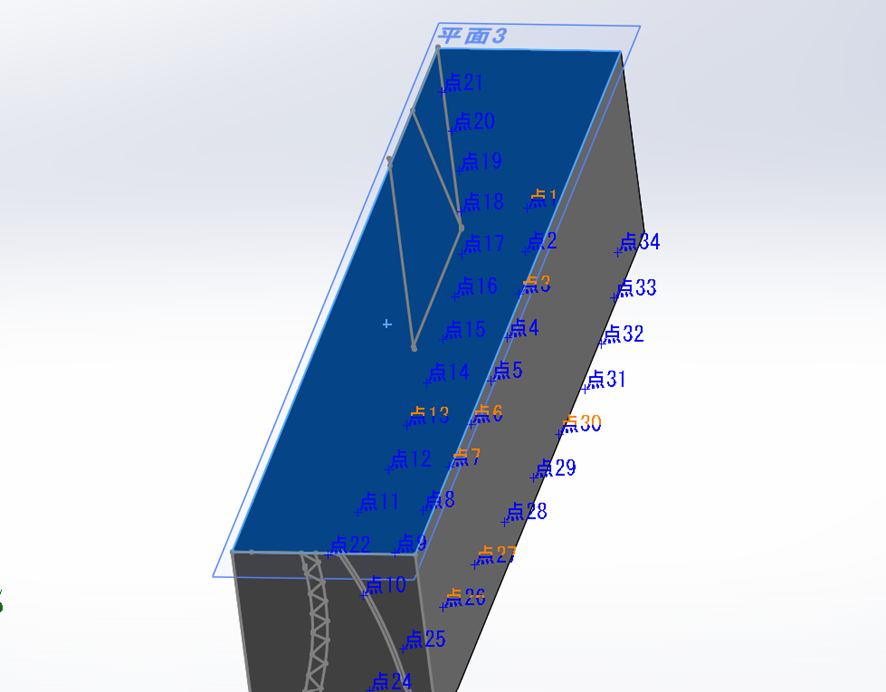

ブロックの輪郭を描画したら次に切り出したい部品の輪郭を描画します。

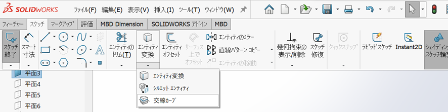

次は「エンティティ変換」の下の三角マークをクリックしてそこにある「シルエットエンティティ」を選択します。ここで曲面を選択すると、文字通りシルエットをスプライン曲線として描画できます。曲面以外の線分・曲線などはエンティティ変換によって射影できます。
　
最後にオフセットを取ります。オフセットは「スケッチ>>エンティティオフセット」を用います。

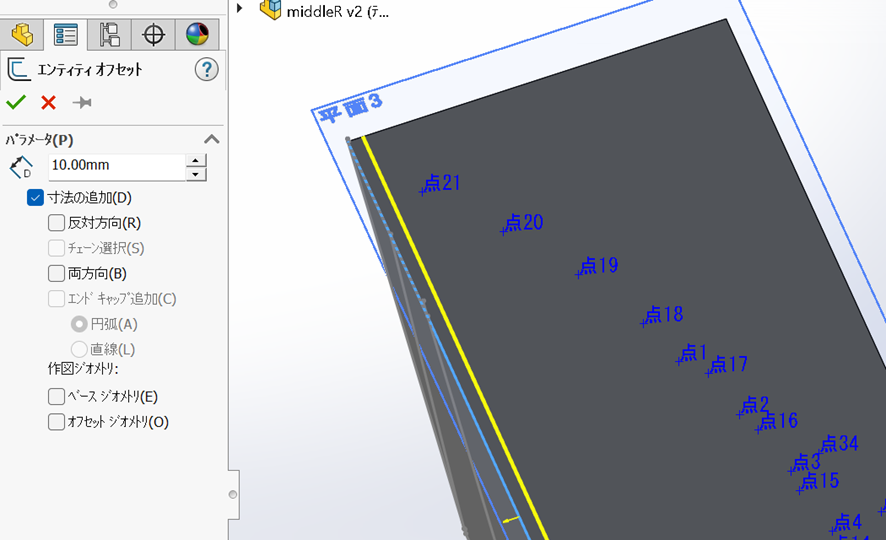

黄色の線がオフセットされた曲線。曲線のどちら側にオフセット曲線が来るかは自動で決まるので、逆側が欲しいときは左の「反対方向(R)」のチェックボックスを入れましょう。
今年は輪郭のカットでは製品の曲面から5mmのオフセットを、くり抜きなどの少し怖い所は10mmのオフセットを取りました。
オフセットを使って厚みを形成することもできます（2023もそうでした）治具を作る同じような曲線（①製品でほしい線②カットで用いるオフセットの線③厚みを指定する線）が3本できてしまいます。今年は手動で「直線」のコマンドを用いて①と③の間をギザギザ線で塗りつぶし、間違えないように工夫しました。

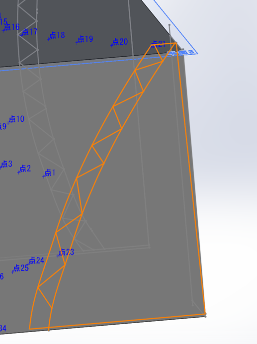

# 実際に起こったトラブルとその対処方法

## その①
凹の曲線でエンティティオフセットしたらエラー吐いたことがあります。全部繋げてオフセットしたからかな～と思って分割したり、スプライン曲線に置き換えたりしましたがダメでした。

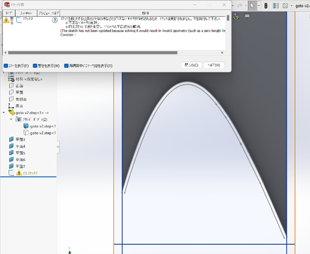

問題のある部分が赤くなるのでそれを右クリックしたらこんな画面になります。ここで「既存拘束関係」を削除したら線はそのままでエラーが突破できました。

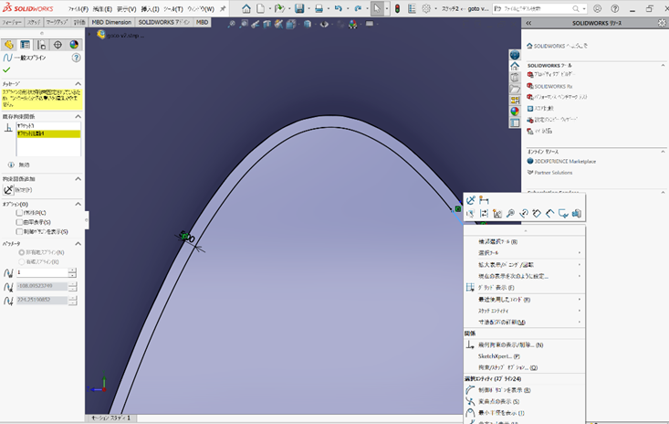

## その②
オフセットした結果中途半端な曲線ができてしまうことがありました。曲線を直線で延長するときは端点ではなく曲線を選択し、（曲線が赤くなるのが目印）平行のマークがでるor黄色い直線に合わせると接線が引けます。

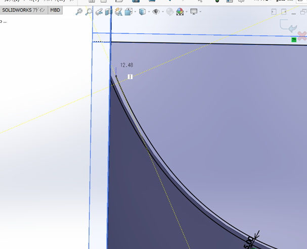

## 成功例

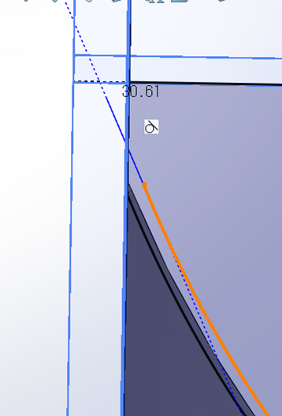

治具を描画し終えたらいよいよpdfデータを作ります。ソリッドを全て不可視にし、描画したスケッチを一枚の図にまとめていくことになります。

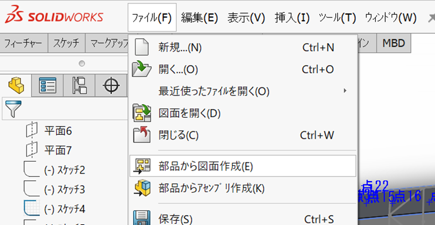

「ファイル>>部品から図面を作成」を選ぶと新しいウィンドウが開きます。
気を付けることをまとめました。

- 印刷物を作るときには「パレット表示＞＞」を開いてドラッグ挿入するとき自動更新をオフにしないと、対面を不可視にしても混ざってしまう
- ここをいじるとデフォの倍率を変えれて便利（デフォルトは1/5スケールになっています。元々三面図用なので実寸大で出力するには倍率を変える必要があります。）

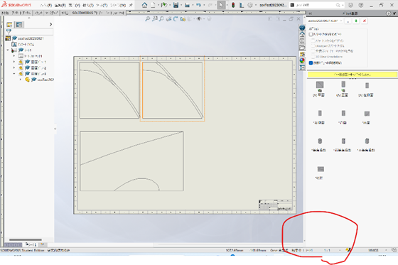

- 自動更新をオフにしないと複数の面が重なって表示されるもしくは勝手に書き換わっててしまう。

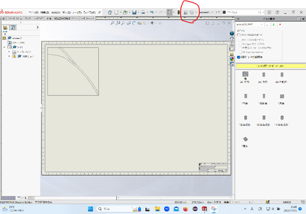
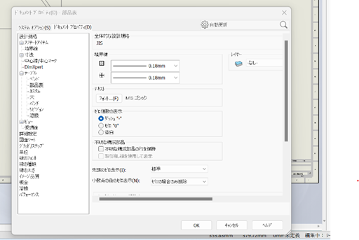

設計規格＞＞テーブル＞＞部品表に進み、一番下のあたりにある。ただし、一番効率的な方法は右上の検索で「自動更新」と検索することだと思います。
- 図面同士が整列するように移動に制限がかかる機能がデフォでついているが、動かしたい物を右クリックし、「ビューの整列」＞＞整列の解除とすれば動くようになります。
- 治具に寸法を入れるなら図面作成画面で「アノテートアイテム＞＞スマート寸法」入れ方はFusion360やInventorのそれと変わらない。

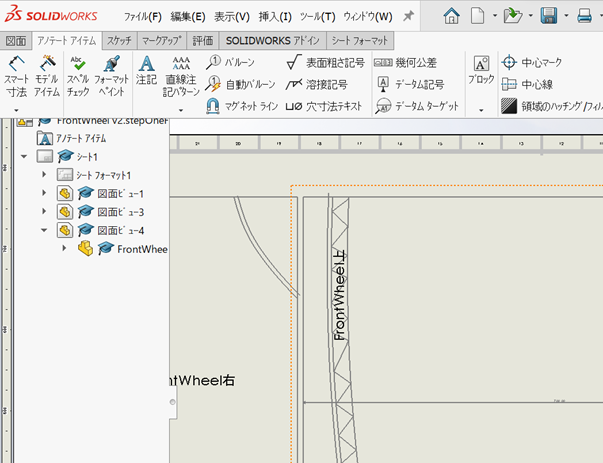

今回は以上となります。
人力飛行機作成に携わっている方もそうでない方もこれを読んで少しでも人力飛行機に、Meisterのフェアリングに興味を持っていただけたら嬉しいです！