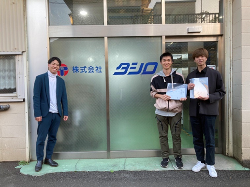
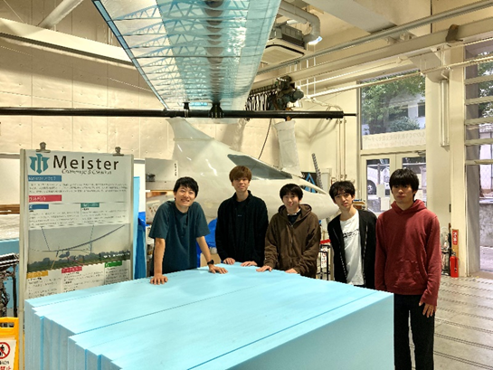
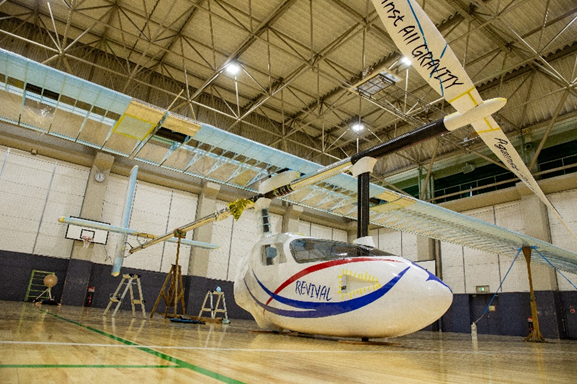
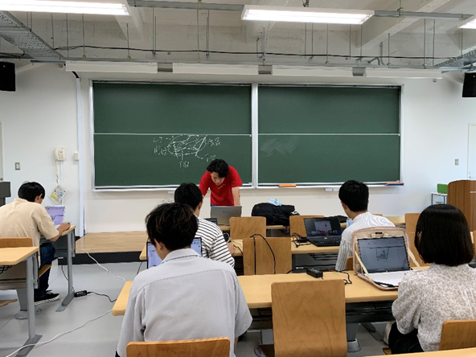
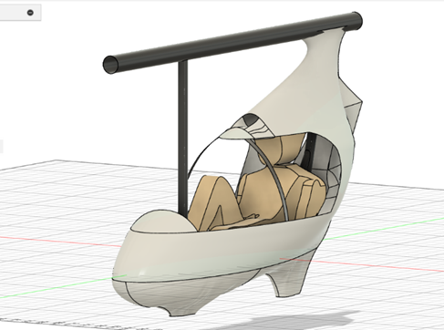
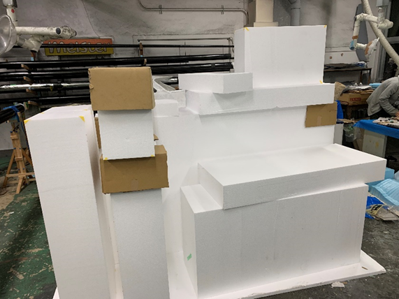
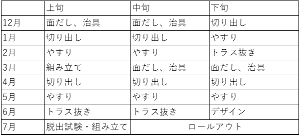

こんにちは。24代Meister広報担当の齋藤です！

今回は10月下旬～12月初旬の活動をまとめさせてもらいました！
目次は以下のようになっています。
今回ピックアップする班はパイロットが登場する部分の周りを囲って守るフェアリングを作っているフェアリング班です！

目次
<!-- @import "[TOC]" {cmd="toc" depthFrom=1 depthTo=6 orderedList=true} -->

<!-- code_chunk_output -->

1. [全体の活動報告](#全体の活動報告)
    1. [企業訪問　～白山工業株式会社HERO lab.～](#企業訪問--白山工業株式会社hero-lab-)
        1. [工大祭](#工大祭)
    2. [ご協賛のご報告](#ご協賛のご報告)
        1. [株式会社タシロ様](#株式会社タシロ様)
        2. [株式会社デュポン・スタイロ様](#株式会社デュポンスタイロ様)
2. [フェアリングの日々](#フェアリングの日々)
    1. [フェアリング班の活動報告](#フェアリング班の活動報告)
        1. [23代鳥コン前](#23代鳥コン前)
        2. [夏休み中](#夏休み中)
        3. [夏休み後半から10月末まで](#夏休み後半から10月末まで)
        4. [11月以降](#11月以降)
    2. [今後の予定](#今後の予定)
    3. [お知らせ](#お知らせ)
3. [まとめ](#まとめ)

<!-- /code_chunk_output -->

# 全体の活動報告
夏休みが終わり、授業も始まりで活動との両立が大変な時期となりました。特に11月下旬から12月頭は東京工業大学は期末試験の時期でした。そんな中でもプロペラ班は企業やOBの方に協力をいただきながら練習型等の作業を、Pフレーム班は荷重試験に向けて桁関連の作業を、翼班は本番翼のリブ切りを半分以上進めるといったように部員が時間を作って本番に向けて製作を推し進めました。
製作以外の主要な事柄に関しては以下に書かせていただきましたので是非最後までご覧いただけたらと思います。
11月には荷重試験も実施しましたが、その件に関しては別の記事にまとめてありますのでそちらも是非ご覧ください。
## 企業訪問　～白山工業株式会社HERO lab.～
&emsp;10月25日(水)に大崎にある白山工業株式会社HERO lab.様を訪問させていただきました。今回の訪問は白山工業株式会社から支援をいただく際に、Meisterと白山工業株式会社HERO lab.様との関係を深める機会として実現しました。
&emsp;会議室にて、Meisterの紹介・活動報告とHERO lab.様の活動紹介をしていただきました。HERO lab.様は動画を使ってわかりやすく活動の紹介をしてくださり、工学系の多いMeister部員にとって大変ためになりました。活動場所の見学もさせていただき、将来の自分の姿を考え始めるきっかけになったと思います。
&emsp;HERO lab.様は社会のニーズに応える様々なロボット、装置の開発をされています。以下のリンクと詳細を確認してみてください！
[極限環境ロボット研究所[HERO Lab.]｜研究開発｜白山工業株式会社](https://hakusan.co.jp)

 
### 工大祭
&emsp;10月28日と29日に東京工業大学の学祭「工大祭」にて出店の出店と作業場見学を行いました！
&emsp;出店は「焼き鳥人間」と称して焼き鳥を売りました。今回の工大祭は出店は25代、つまり今の学士一年生が主体となって企画し、実施してくれました。25代の中で役割分担をして、みんなで作り上げたことで絆が深まったと思います。メニューが「かわ・つくね・ぼんじり・ねぎま・もも」と比較的多く、立地が良かったこともあり、大盛況で工大祭を駆け抜けることができました。来てくださった方々ありがとうございました。

&emsp;これに対し執行代である24代はより多くの人にMeisterの活動を知っていただきたいということで倉庫見学を実施しました。実施することを決定するのが遅く、前々日くらいから急遽準備を始めましたが出店のシフトからあふれた25代が手伝いに来てくれたり、一日目終了後に有志でレイアウトを改善してくれたりしたことで、なんとか形にすることができました。大画面でのTF動画(テストフライト動画)を含むMeister紹介ムービーの放送や今年飛ばした23代の機体の残してあった翼の一部、試験翼、昨年度のTF用のフェアリング、フレーム、桁、昨年度以前のペラ、三面図等様々なものを展示し、触ることもありで部員で説明をしました。実際に触ってもらうことでフェアリングやペラの軽さを実感してもらいました。想像以上の大盛況となり、本当に感謝の念でいっぱいです。募金箱も設置させていただきましたが、多くの人にご寄付をいただくことができました。また、OBの方々や他の鳥人間サークルの方にも来ていただき、有意義な情報提供や情報交換をさせていただきました。一部のOBの方には見学の対応もしていただけて本当に助かりました。この場を借りて改めてお礼申し上げます
&emsp;倉庫見学、出店を通じて多くの人に応援していただけていること、興味を持っていただけていることを実感できより一層、前向きに製作に励むことができています。今後とも応援の程よろしくお願いいたします。

## ご協賛のご報告
&emsp;前述の白山工業株式会社HERO lab.様にはご寄付をいただきましたが、10、11月中に、他に2社からご協賛をしていただくこととなりました。
ご協賛していただいた企業は以下の通りです。
本当にありがとうございます。
### 株式会社タシロ様
&emsp;プロペラの治具の製作をしていただきました。さらに治具完成後の受取時から、金属購入に関する相談にも乗っていただいています。プロの方からお話を聞けてとても助かっております。
　株式会社タシロさんは既存の金属加工のみならず、社員の方のアイディアをもとにした自社製品の開発など、新しいことにも積極的に取り組まれています。詳しくは以下のリンクをご確認ください！

[株式会社タシロ　ホームページ](http://www.tasiro.co.jp/)

### 株式会社デュポン・スタイロ様
&emsp;Meisterだけでなく他の多くの鳥人間サークルにおいて人力飛行機を作成するのに必要不可欠なスタイロフォームを作成し取り扱っていただいている株式会社デュポン・スタイロ様からスタイロフォームの協賛という形での提供をいただきました。
　スタイロフォームは人力飛行機の翼やプロペラの治具等、様々なところでしようさせていただいています。特にその加工性の高さと軽いのに剛性がある性質から翼の二次構造の製作において重宝させていただいております。年間で使う分のスタイロフォームをご提供いただき、感謝の気持ちでいっぱいです。今後とも人力飛行機の製作を応援していただけると幸いです。
株式会社デュポン・スタイロ様の詳細については以下のリンクからご確認ください。

[株式会社デュポン・スタイロ　ホームページ](https://www.dupontstyro.co.jp/)

# フェアリングの日々
&emsp;こんにちは！東京工業大学Meisterで24代としてフェアリング班の班主任をやらせてもらっているものです。今回はフェアリング班の活動報告、これからの予定を書かせていもらいました！

## フェアリング班の活動報告
### 23代鳥コン前
&emsp;23代の鳥コン前は「REVIVAL」の本番用フェアリングを制作し、鳥コンに向けて準備していました。新入生は今年4人がフェアリング班に入ってくれたので班全体が活気ある雰囲気となりました。また、本番用フェアリングを製作するとともに、24代として今までになかったパーツ分割の方法に挑戦するため、25代の作業の練習も兼ねながら試作としてフネの縮小パーツを作ったりしました。25代にも本番用フェアリングの製作も手伝ってもらい、鳥コン本番では美しいフェアリングを有した「REVIVAL」が琵琶湖の空を飛びました。23代をはじめ、応援していただいた先輩方、支援していただいた方々には感謝しても感謝しきれないほどお世話になりました。本当にありがとうございました。

### 夏休み中
&emsp;2023年の鳥コンが終わり、大学の期末試験が終わり、夏休みに入ると24代主体として本格的に活動を始めました。夏休みの最初に行ったことは「フェアリング概論」です。フェアリング概論とは入部したばかりの25代に対して、フェアリングについて知ってもらうために過去の資料を用いて24代が説明していく会のことです。第1回は人力飛行機について、人力飛行機はどのようなものなのか、ということとフェアリングの役割、設計の際に必要なソフトや用語などを伝えました。第２回はフェアリングの基礎について、インテーク、アウトレット、パーツの名前、製作の大まかな流れなどを、歴代のMeisterのフェアリングを用いて話しました。第3回では、他の学生チームや社会人チームのフェアリングを見て、HPA交流会に向けて知識を増やしました。
&emsp;HPA交流会では、他チーム様とたくさんのお話ができ、大変有意義な時間となりました。また、以前から他チームの皆様にお聞きしたかったフェアリングを覆う熱縮フィルムについても聞くことができました。HPA交流会を主催していただいた筑波大学つくば鳥人間の会様、お話をしていただいて各チームのフェアリング班の皆様、本当にありがとうございました。
&emsp;フェアリング概論、HPA交流会でフェアリングについての基礎知識を25代に伝えたのちに、Fusion360をもちいたフェアリング設計練習会を行いました。この練習会で2４代が先輩方から引き継いだ設計の方法を24代でアレンジを加えていきながら25代の全員に一人一つのフェアリングを設計してもらいました。

### 夏休み後半から10月末まで
&emsp;この時期には実際に25代に一人一つフェアリングのパーツを作ってもらいました。24代とともに面だし、切り出し、治具製作、やすりを一通り体験してもらうことで、TF用製作がスムーズに行えるように工夫しました。製作練習の後半には25代が自分たちだけで考えて効率よく作業をしてくれました。また、設計練習会や製作練習の作業を通して、班内でコミュニケーションをとる機会が増え、フェアリング班内の雰囲気が明るくて、溌剌としたものになっています！



### 11月以降
&emsp;11月の初旬に発注していた発砲スチロールのブロックが届き、TF用フェアリングの製作が始まりました。届いてすぐ基準面を決め、面だしを開始しました。設計が決定したので、パーツ分割を行い、治具製作も同時に製作し始めました。

&emsp;進捗としては去年度と同じ程度、やや進んでいるという状況となっております。今年は執行代3人、25代4人という例年に比べて他人数の班編成となっておりますので、最高のフェアリングを製作し来年の夏、琵琶湖で舞うことを目標としております。

## 今後の予定
　今後の予定をご紹介します。

 

## お知らせ
&emsp;最後になりますが、24代では、しばらくの期間機能していなかった東京工業大学Meisterフェアリング班の公式X（旧Twitter）アカウントを再び動かし始めました。投稿頻度はあまり多くはないかもしれませんが、今後の進捗等を挙げていく予定ですので、ぜひご覧ください。
[フェアリング班アカウント](https://twitter.com/@Meister_fairing)

&emsp;今後も応援よろしくお願いいたします。

# まとめ

ここまでご覧いただきありがとうございました。Meisterの活動はこれからも続いていきますので繰り返しになりますが応援のほどよろしくお願いいたします。
何かアドバイスなどありましたら下にまとめてある連絡ツールによろしくお願いします！

Twitter <i class="bi-twitter"></i>：[@titech_meister](https://twitter.com/titech_meister)

Instagram <i class="bi-instagram"></i>：[@tokyotechmeister](https://instagram.com/tokyotechmeister)

掲示板 <i class="bi-bbs"></i>：[https://meister.ne.jp/bbs/](https://meister.ne.jp/bbs/index.rb)