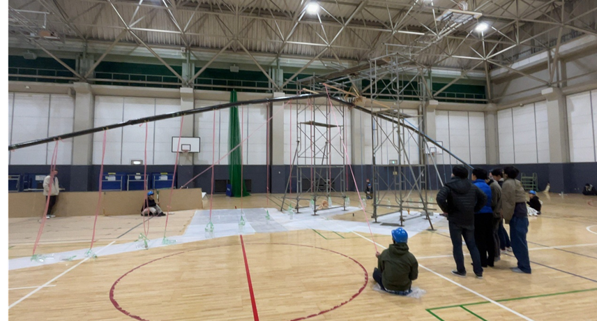
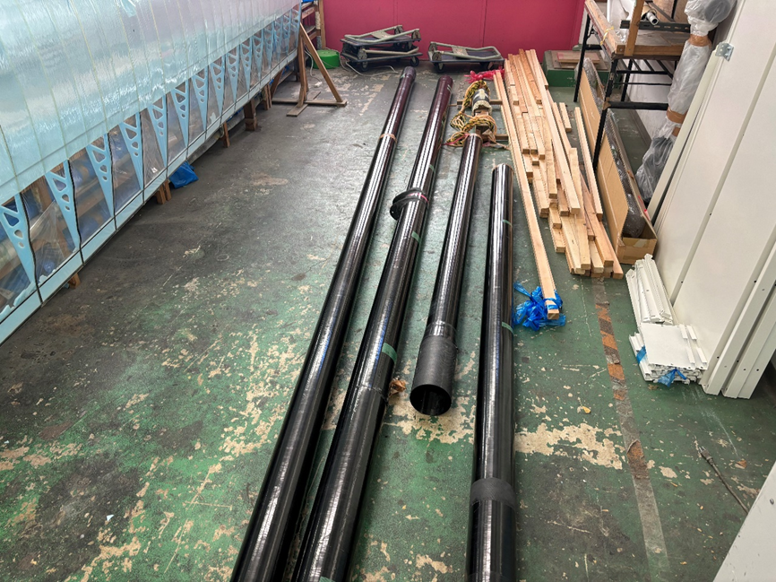
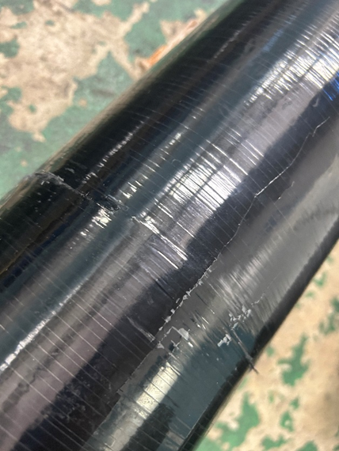
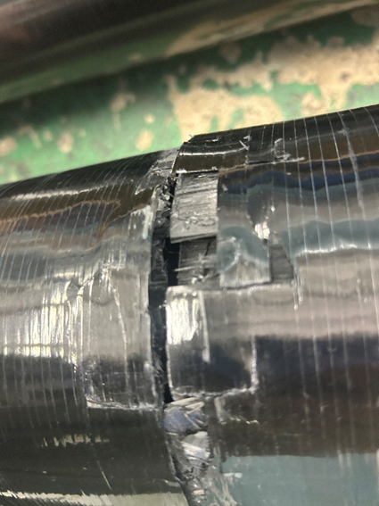
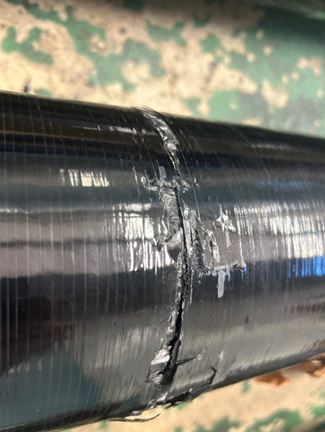

目次
<!-- @import "[TOC]" {cmd="toc" depthFrom=1 depthTo=6 orderedList=true} -->

<!-- code_chunk_output -->

1. [荷重試験](#荷重試験)
    1. [事実](#事実)
    2. [損害](#損害)
    3. [破断面の考察](#破断面の考察)
    4. [原因](#原因)
    5. [その後の対応](#その後の対応)

<!-- /code_chunk_output -->

# 荷重試験
11月18日の夜から11月19日の朝にかけて荷重試験を行いました！
荷重試験は簡単に言えば人力飛行機の主翼の骨組みである桁の強度と剛性を確かめる試験で、安全性を加味して荷重に対するたわみを設計段階で計算するのでそれと一致するか、特に問題はないかを確認するのでこれをクリアすれば品質的にはイレギュラーな使い方をしなければ問題ないということになります。
　結果から言いますと、今回の**荷重試験は失敗**に終わってしまいました。
以下詳細です。
主翼桁の中心から外側にA,B,C,Dと桁に名称を付けています。左右対称でAは中心なので全部で7つの桁で主翼桁を構成しています。

## 事実

2023年11月18~19日にかけて行われた主翼桁のみの荷重試験中に発生。
1G→1.2G、全体で57/60番目のおもりをかけた直後、大きな音を立てて翼根からR側約1.5mの位置でA桁が破断し、その余波によりBR、BLが空中で破断しました。Ｒ端が用意してあったクッション上、Ｌ端が体育館の床に叩きつけられ、最終的に桁は静止しました。

 

## 損害

11/19時点確認分
Ａ・Ｂ：完全な破断。

Ｃ・Ｄ：表面に異常は見られず。

## 破断面の考察

A横面

A上面

A下面

B


Aは**ねじりによる破壊**と断定しました。また、BはAがねじ切れた衝撃による慣性力でねじられて破壊されたと推測しました。

## 原因

**破壊要因**
剛性中心からの荷重のずれによる前後たわみとそのねじり連成が許容値を超えた。
破壊要因が生まれた原因として考えられるものは以下の通りです。
- 翼胴接合の基準がなく、精度が出ていなかった。
- おもりかけ中のピッチングの確認が不足しており、致命的なねじりが起こっていることに気づけなかった。
- 剛性中心を探る手段を講じていなかった。
- リアスパを入れる前提でPLを最大10層入れた桁であったため前後剛性が低かった。
- 吊り下げ方式による桁の揺れ。
- ＢＣ間斜めかんざしの接合精度が低く、Ｃ以降桁が傾いていた。

## その後の対応
- 前述の通りCDの荷重試験を行い、無事を確認。
- Aマンドレルのたわみの影響を低減するためAを5m→4mに設計変更
- 次の荷重試験を2月に設定、リアスパ・リブがある状態で実施
- 荷重試験の方法の見直し
- 桁のねじれを確認できるよう治具を立てる
- 吊り下げ方式の是非を議論
- 前後たわみ・ねじりを考慮した桁計算の確立

桁が折れてしまったことによって折れた桁以外にも床との衝突を含め衝撃が加わってしまっているので11月と12月第一週にて折れていない桁についても個別で荷重試験を行いました。その結果折れた桁以外の安全性は担保することができました。
　今後桁を作り直し、それが終わったら再度主翼桁全体での荷重試験を行う予定です。今回の反省を生かしてリアスパー桁を付けた状態で精度を意識して行うことになります。
12月第二週から桁巻きの日々がまた始まりました。12月中に折れてしまった主翼の桁以外にもペラから尾翼まで伸びるMeisterではメインビーム・テイルと呼んでいる桁も12月中に作り直すことになります。かなりハードな日々となりますが、最高のフライトがお見せできるように精一杯頑張りますので応援の程よろしくお願いいたします。
桁の作り直しに伴い、素材を追加購入したため財政難により一層陥ってしまっています。ご寄付やご協賛をいただける企業、個人様がいらっしゃいましたら支援のページをご覧になっていただけたら幸いです。