あけましておめでとうございます、24代電操班です。

今回のブログは12月の活動報告と、電装操舵班の活動をピックアップして報告させていただきます。 

<!-- @import "[TOC]" {cmd="toc" depthFrom=1 depthTo=4 orderedList=true} -->

<!-- code_chunk_output -->

1. [全体の活動報告](#全体の活動報告)
    1. [サークル内行事](#サークル内行事)
        1. [ものつくり教育研究支援センターサークル会議(12/13)](#ものつくり教育研究支援センターサークル会議1213)
        2. [ものつくりサークル交流会(白星会)(12/9)](#ものつくりサークル交流会白星会129)
        3. [学内駅伝(12/10)](#学内駅伝1210)
        4. [ひらめきときめきサイエンス (12/27,28)](#ひらめきときめきサイエンス-122728)
    2. [いただいた支援のご報告](#いただいた支援のご報告)
        1. [1.ZONE　様](#1zone-様)
        2. [2.有限会社CAST　様](#2有限会社cast-様)
2. [電操班の活動報告](#電操班の活動報告)
    1. [概要](#概要)
    2. [操舵系の進捗](#操舵系の進捗)
        1. [モックアップ](#モックアップ)
            1. [リンク機構の設計](#リンク機構の設計)
            2. [モックアップの製作](#モックアップの製作)
            3. [動作確認及び強度試験](#動作確認及び強度試験)
        2. [本番用カーボン積層板の焼成](#本番用カーボン積層板の焼成)
        3. [操舵設計](#操舵設計)
            1. [機体の動的解析](#機体の動的解析)
            2. [シミュレータの開発](#シミュレータの開発)
            3. [胴体桁の設計](#胴体桁の設計)
    3. [電装系の進捗](#電装系の進捗)
        1. [ピトー管の設計](#ピトー管の設計)
        2. [桁焼き温度計](#桁焼き温度計)
        3. [新型サーボの選定&検証](#新型サーボの選定検証)
        4. [新型サーボの動作確認](#新型サーボの動作確認)
3. [まとめ](#まとめ)

<!-- /code_chunk_output -->

---

# 全体の活動報告
遅くなってしまいましたが新年の挨拶とあわせまして、12月後半の活動と一月序盤の活動をまとめさせていただきます。

## サークル内行事

### ものつくり教育研究支援センターサークル会議(12/13)

東工大に多数存在するものつくりサークルの方々と自己紹介や活動報告会、センターの利用方法等について話し合いました。
学内のものつくりサークルは東工大HPで紹介されておりますので、ぜひご一読ください。(https://admissions.titech.ac.jp/public-relations/campus/activity/feature)

### ものつくりサークル交流会(白星会)(12/9)

東工大の機械系・システム制御系同窓会である白星会主催のサークル交流会に参加しました。交流会では会員の方々に活動報告をさせていただき、その後の食事会では部員と会員の交流を深めさせていただきました。また、多額の支援金や募金をいただきました。この場をお借りして御礼申し上げます。

### 学内駅伝(12/10)

12/10に開催された学内駅伝に23,24,25代より五人で出場して優勝しました。過去2016年の代に出場した際の記録が残っていましたので、記念に写真を撮らせていただきました。
（ここにtwitterから比較画像）

### ひらめきときめきサイエンス (12/27,28)

12/27から28にかけて、ひらめきときめきサイエンスというイベントに参加しました。ひらめきときめきサイエンスでは、小中学生の方々にものつくりセンターと作業場を見学していただき、普段どのように活動しているのかを知っていただくことを目的としています。

## いただいた支援のご報告

### 1.ZONE　様
ZONe Student Booster様より、エナジードリンクZONeのご提供をいただきました。桁巻きなどの作業に活用させていただいています！

### 2.有限会社CAST　様

カーボンクロス等製作に必要な材料を購入させていただいている有限会社CAST様より、値引きの支援をいただきました。この場をお借りして心より感謝申し上げます。

---

# 電操班の活動報告

## 概要

まず、電操班の主な活動内容を紹介します。

電操班は、尾翼機構をつくる操舵系と、機体のに電装系を設計・製作しています。

## 操舵系の進捗

11月~12月にかけて、大きく4つの作業を行いました。

- モックアップの機構の設計&製作(11月)
- 本番用カーボン積層板の焼成(12月)
- 操舵設計(11~12月)

### モックアップ

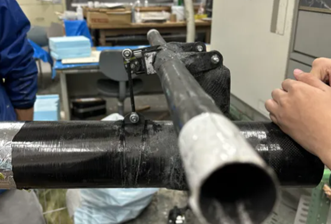

例年、Meisterでは本番用の操舵系の製作に入る前に、操舵系のモックアップを作っています。

今年は、接合部分の構造を変更したため、モックアップを用いて強度の確認を行う必要がありました。
また、サーボの負荷を軽減するために、可動域を加味した設計を試しました。

#### リンク機構の設計

リンク機構を以下の図のようにモデル化した。

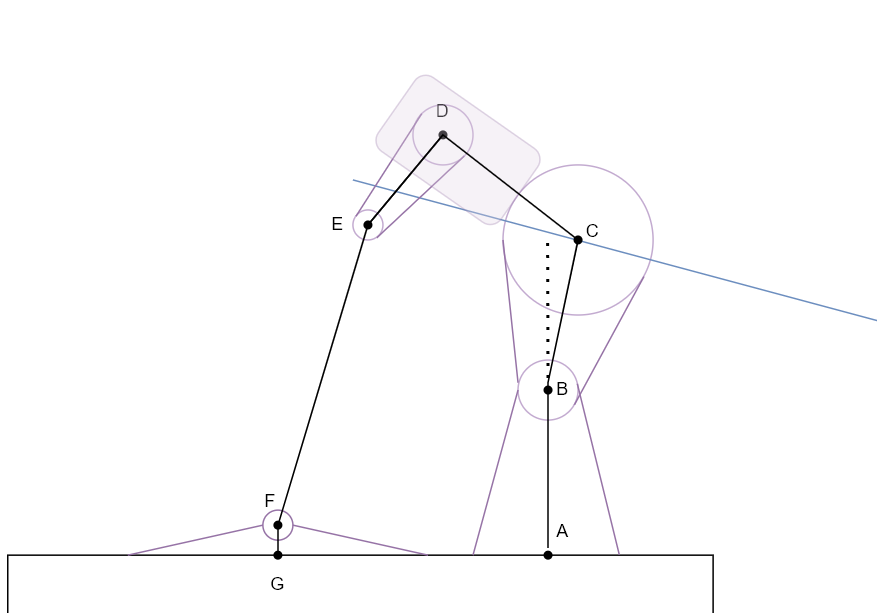

|区間|名称|
|:-:|:-:|
|A-B|U字|
|B-C|桁とベアリングを繋ぐパーツ（通称　マル）|
|C-D|サーボマウント|
|D-E|ホーン（通称　雫）|
|E-F|ロッド|
|F-G|フランジ|
|G-A|V字の中心-フランジ間の距離|
|青線 (BCに直交)|尾翼の翼弦|

このモデルを用いて、サーボの角度と尾翼の角度の関係を幾何的に考察しました。
考察から得られた結果を用いて、以下の条件を満たすように部品のサイズを決定しました。

- サーボの可動域は-75°~75°
- 尾翼の可動域は-10°~10°

実際に製作したモックアップでのサーボの角度と尾翼の角度の関係を以下に示します。

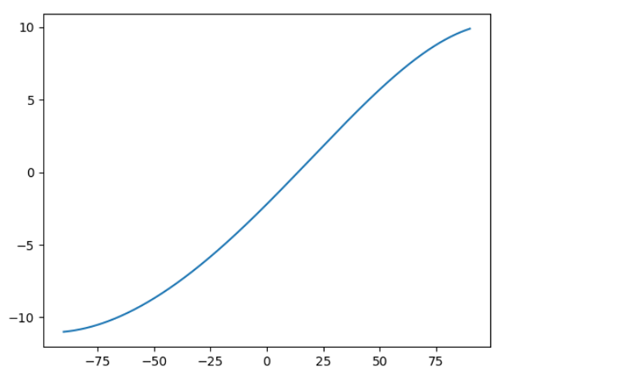

#### モックアップの製作

##### U字の製作

これまでのMeisterでは、尾翼の接合部分はV字型の構造をしていました。
今年はU字型の構造に変更し尾翼まわりでの軽量化を図りました。
U字型の構造を実現するために、Pフレーム班のマンドレルを利用しました。
しかし、ピールの貼り方が良くなかったため、下層のプリプレグが浮いてしまいました。

##### オーバーレイの採用

これまでのMeisterでは、V字とV字ツメの接着をエポで接着し、ロービングを巻くことで強度を持たせようとしてきました。
しかし、この方法であると、尾翼からかかる力をほとんど接着面だけで持つことになり、重量に対しての強度が全く得られていませんでした。
そこで、今年は、V字とV字ツメの接着面を増やすために、V字ツメの部分にオーバーレイしました。
これにより、接合部分でサンドイッチ構造をつくることができ、前後左右方向の荷重に耐えられるようになります。
オーバーレイは、モックアップの製作時は生クロスが浮いてしまいました。

    

        </img>
        浮いてしまった(´;ω;｀)
    

    

        </img>
        オーバーレイ
    

##### ロッドの製作

昨年の鳥人間コンテストでは、ロッドの接合部分がプラスチックでできており、琵琶湖の高温で変形してしまいました。
そこで、今年は、ロッドの接合部分を金属パーツに変更しました。
これまではロッドエンドをネジで固定していたが、金属パーツに変更したことで、穴をあけることが困難になりました。
そのため、エポキシ接着剤で接着することにしました。

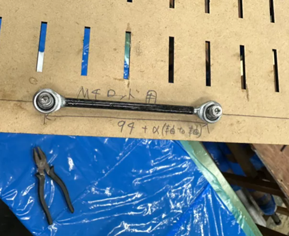

#### 動作確認及び強度試験

モックアップの製作後、動作確認及び強度試験を行いました。
動作確認では、サーボの角度を-75°~75°で変化させると、尾翼の可動域が-10°~10°になることを確認しました。

強度試験に関しては、以下の画像のように、モックアップを固定し、尾翼に荷重をかけました。
想定よりも遥かに強度が高かったため、U字の構造はラダーにも採用することにしました。

    

        </img>
        しっかり切れていることがわかる
    

    

        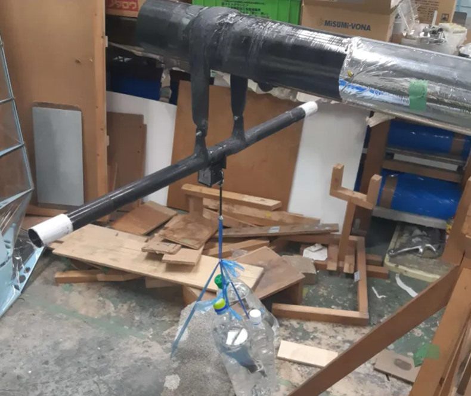</img>
        脳筋荷重試験
    

### 本番用カーボン積層板の焼成

クリスマスイブの桁焼きの裏で、カーボン積層板を焼成しました。
今回は、昨年のどの平板よりもきれいに焼成できました。
この積層板は、操舵機構のカーボンパーツとして使用する予定です。

### 操舵設計

今年は、尾翼の設計のために機体の動的特性解析を行いました。

#### 機体の動的解析

微小擾乱理論より、機体の運動方程式は以下のように表されます。

$$
\begin{aligned}
    \begin{bmatrix}
        \dot{u} \\\
        \dot{w} \\\
        \dot{q} \\\
        \dot{\theta}
    \end{bmatrix}
    &=
    \begin{bmatrix}
        \frac{X_u}{m} & \frac{X_w}{m} & \frac{X_q}{m} & -g \cos \theta \\\
        \frac{Z_u}{m} & \frac{Z_w}{m} & \frac{Z_q}{m} & -g \sin \theta \\\
        \frac{M_u}{I_y} & \frac{M_w}{I_y} & \frac{M_q}{I_y} & 0 \\\
        0 & 0 & 1 & 0
    \end{bmatrix}
    \begin{bmatrix}
        u \\\
        w \\\
        q \\\
        \theta
    \end{bmatrix}
    +
    \begin{bmatrix}
        \frac{X_{\delta_e}}{m} & \frac{X_{\delta_t}}{m} \\\
        \frac{Z_{\delta_e}}{m} & \frac{Z_{\delta_t}}{m} \\\
        \frac{M_{\delta_e}}{I_y} & \frac{M_{\delta_t}}{I_y} \\\
        0 & 0
    \end{bmatrix}
    \begin{bmatrix}
        \delta_e \\\
        \delta_t
    \end{bmatrix} \\\
    \begin{bmatrix}
        \dot{v} \\\
        \dot{p} \\\
        \dot{r} \\\
        \dot{\phi}
    \end{bmatrix}
    &=
    \begin{bmatrix}
        \frac{Y_v}{m} & \frac{Y_p}{m} & \frac{Y_r}{m} & g\cos\theta \\\
        \frac{L_v'}{I_x'} & \frac{L_p'}{I_x'} & \frac{L_r'}{I_x'} & 0 \\\
        \frac{N_v'}{I_z'} & \frac{N_p'}{I_z'} & \frac{N_r'}{I_z'} & 0 \\\
        0 & 1 & \tan\theta & 0
    \end{bmatrix}
    \begin{bmatrix}
        v \\\
        p \\\
        r \\\
        \phi
    \end{bmatrix}
    +
    \begin{bmatrix}
        \frac{Y_{\delta_a}}{m} & \frac{Y_{\delta_r}}{m} \\\
        \frac{L_{\delta_a}}{I_x'} & \frac{L_{\delta_r}}{I_x'} \\\
        \frac{N_{\delta_a}}{I_z'} & \frac{N_{\delta_r}}{I_z'} \\\
        0 & 0
    \end{bmatrix}
    \begin{bmatrix}
        \delta_a \\\
        \delta_r
    \end{bmatrix}
\end{aligned}
$$

この運動方程式を用いて、機体の動的特性を解析しました。
安定微係数やControl Matrixの計算では、翼型解析に用いていたXFLR5を用いました。
機体の動的特性解析の様子です。

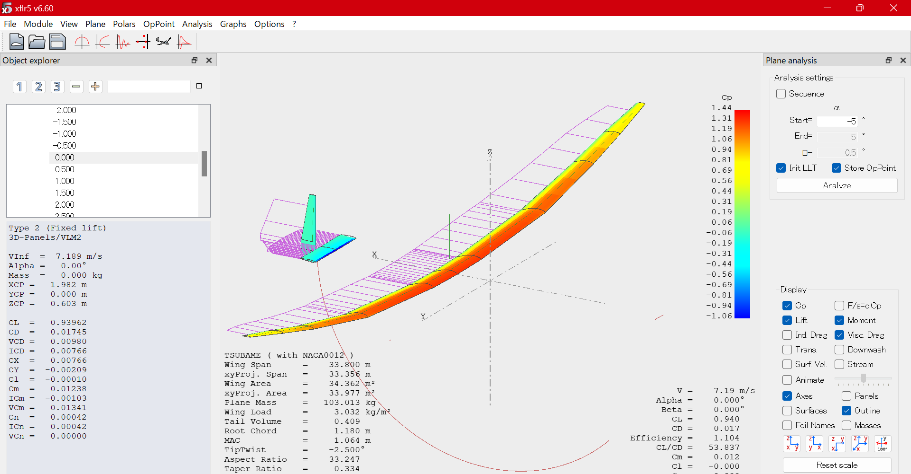

この解析結果を用いて、操舵系の設計を行いました。
結果として、（理論上ではありますが）スパイラル安定な操舵系を設計することができました。

#### シミュレータの開発

機体の運動方程式を導くことができたので、Pythonでシミュレータを開発しました。
設計した機体の運動をシミュレーションして、その操作のしやすさを確認しました。
将来的には、このシミュレータを用いて、パイロットが練習できるようにしたいと考えています。

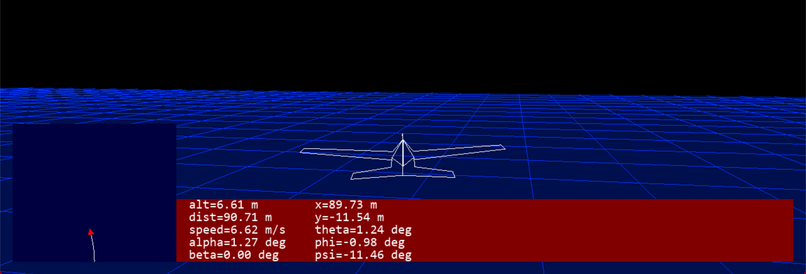

また、matlabやUnityでもシミュレータを開発しています。

    

        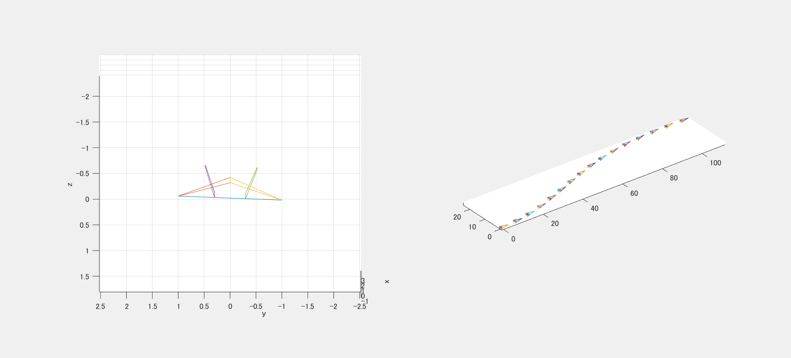</img>
        matlab版
    

    

        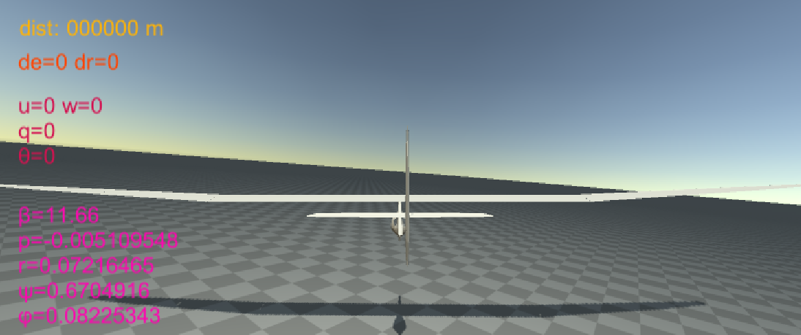</img>
        Unity版
    

#### 胴体桁の設計

胴体桁/テール桁の設計のために、3次元での構造計算を行う必要がありました。
（梁の大変形理論）
そのための解析プログラムをPythonで実装しました。

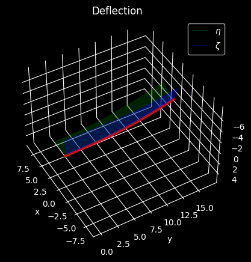

## 電装系の進捗

電装系では、主に以下の作業を行いました。

- 基板設計の練習(10~12月)
    - Debuggerの設計が完了(12月)
    - 本番用の基板設計に移行(1月~)
- ピトー管の設計(10~12月)
    - 3Dプリンタで作成(12月)
    - ANSYSで解析(1月~)
- 桁焼き温度計(11月~12月)
- ピスタチオ(~11月)
- モーターの選定&動作(11月~12月)

### ピトー管の設計

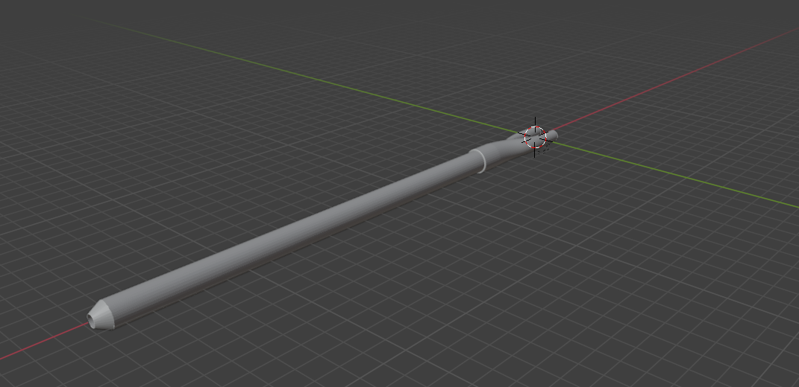

ピトー管の規格、買う物品を決定しました。
このあと、ANSYSで流体解析を行う予定です。

### 桁焼き温度計

Meisterでは23代より桁焼きの方法を過去の台と変えているため、電熱線やガラス管等いろいろと新たに環境構築をしました。
その中で温度はK型熱電対と市販の温度計を用いて計測していましたが、電池代や故障、一定時間おきに記録する手間などを鑑みて自動化が急がれていました。
今回製作した温度計によって、自動で温度上昇履歴を閲覧＆保存することができます。
以下には、温度計の仕組みを簡単に記します。
熱電対のワイヤーをターミナルで基板につなげて、MAX31855を使用した市販のK型熱電対用アンプモジュールを介して温度を読み取っています。マルチプレクサで入力先を選択することで一つのモジュールで8点の温度を測定することが可能になっています。マイコンにはraspberry pi pico w を使っており、Bluetoothで簡単に温度監視が行えます。
また、K型熱電対用のコネクタではなくターミナルで接続しているのはコネクタのプラスチック内部で熱電対がショートしてしまう現象が多発したからです。
温度監視はPySimpleGuiで作成したアプリを使用しております。(画像のerrorは修正済)
12月はMB,B,Aの桁巻き・桁焼きを行い実践投入しましたが、良好に測定ができています。
今後の展望として二つの改善点があります。

1. GoogleSprreadSheetへの対応
 温度を手入力していた際はスプレッドシートに記録することで現地にいない部員も以上に気づけるようにしておりましたが、現状では計測アプリを配信することで代用しております。記録先をGoogleSprreadSheetにすることでより使いやすくなると思われます。

2. プリント基板verの作成
 基板作成能力が微妙なため、最大5度ほどの誤差が確認されますので、基板設計が急がれます。 

    

        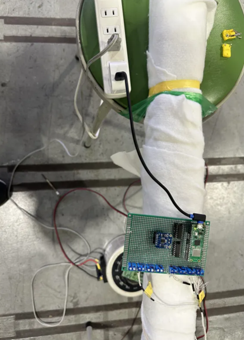</img>
        実装した基板
    

    

        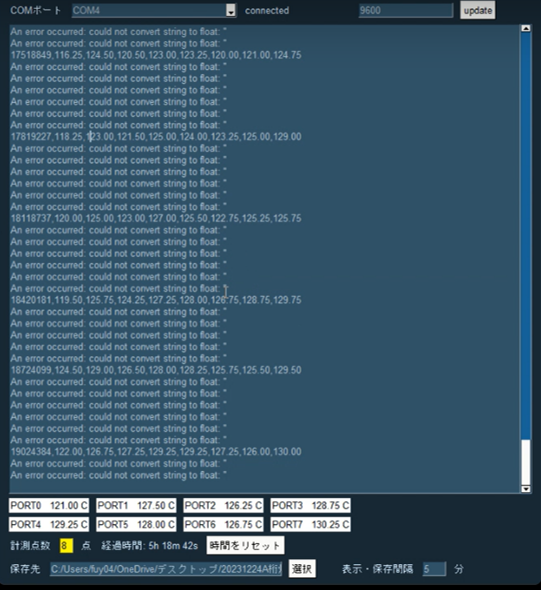</img>
        温度監視用アプリ
    

### 新型サーボの選定&検証

2012年から、MeisterではRS405CBというサーボモーターを使ってきました。
しかし、それが廃番になったため、今年からは違うサーボを使うことにしました。

当初は、RS405CBの後継のBLA21-12R3-C01を使う予定でしたが、手に入るのが2月以降であることが判明しDynamixelのサーボを使うことにしました。

いくつかのサーボを比較してDynamixel XM430-W350-Rというサーボを採用することにしました。以前のサーボ（RS405CB）に比べて、、

- 耐熱温度が高い
- トルクは小さい
- ドキュメントがかなりしっかりしている
- 各動特性を設定できる

という特徴があります。RS405CBと同じく、RS485で通信することができるため採用しました。

### 新型サーボの動作確認

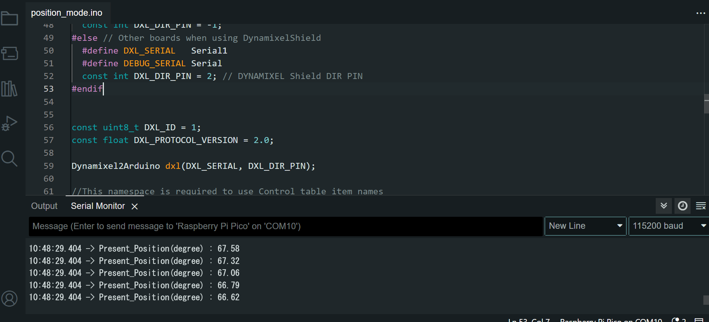

既存のケーブルは使えないことが判明し、新たにServoBatteryModuleを設計をすることになりました。

1月からは、従来の操舵基板のプログラムをdynamixelのサーボに対応させることになります。

# まとめ

ご閲覧いただきありがとうございました。大変な年になりそうですが、今年もMeisterをどうぞよろしくお願いします。
アドバイスやコメント等ございましたら、下記までお気軽にご連絡ください！
