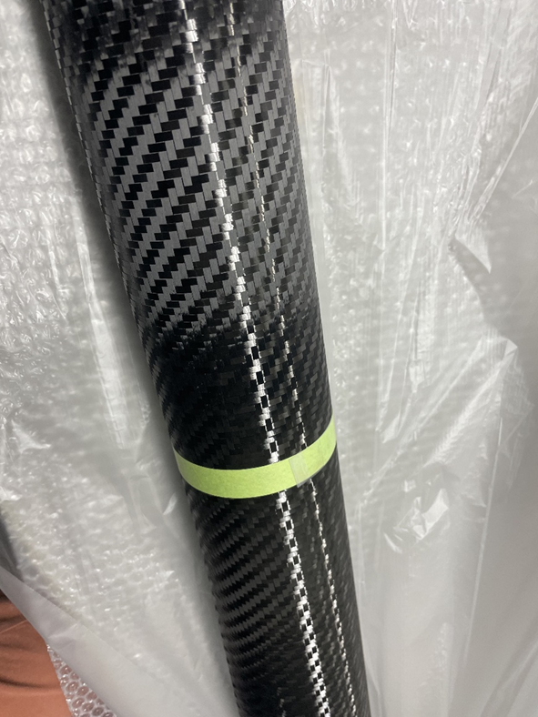
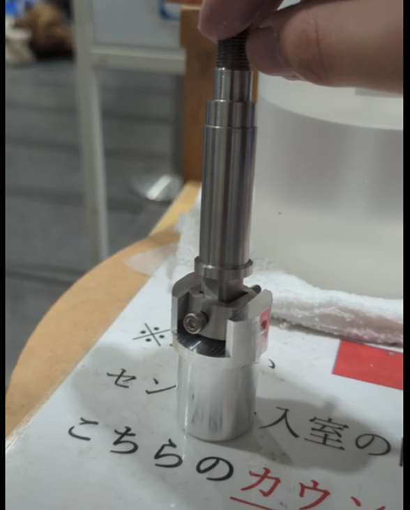
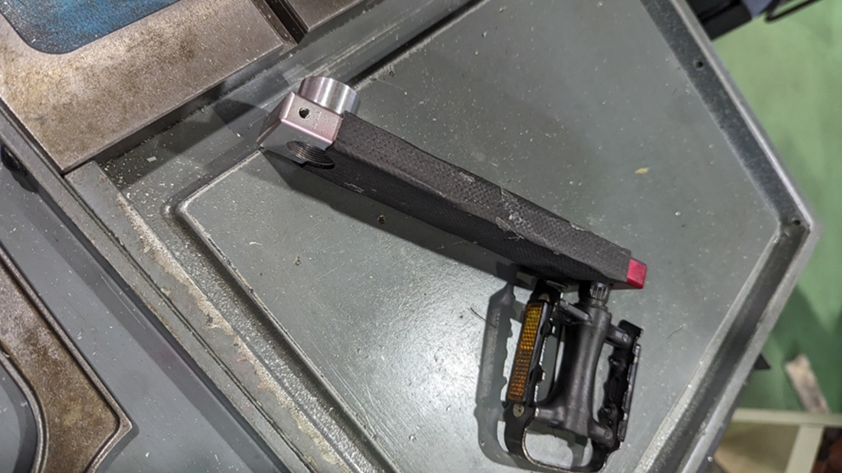
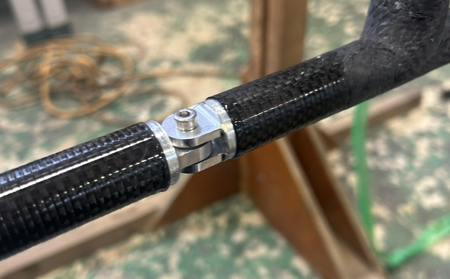

今月のブログは１月の活動報告と駆動班の紹介となります。

<!-- @import "[TOC]" {cmd="toc" depthFrom=1 depthTo=6 orderedList=true} -->

<!-- code_chunk_output -->

1. [全体の活動報告](#全体の活動報告)
    1. [株式会社タシロ様へMeister倉庫へのご案内(1/17)](#株式会社タシロ様へmeister倉庫へのご案内117)
    2. [Meister総会兼顧問 井上先生送別会(1/27)](#meister総会兼顧問-井上先生送別会127)
    3. [鳥人間コンテスト2024への出場申込書類作成(1/24~2/9)](#鳥人間コンテスト2024への出場申込書類作成12429)
    4. [Meisterへ協賛してくださった企業様](#meisterへ協賛してくださった企業様)
        1. [サカイオーベックス株式会社様](#サカイオーベックス株式会社様)
2. [駆動班の活動報告](#駆動班の活動報告)
    1. [新型ユニバーサルジョイントの開発](#新型ユニバーサルジョイントの開発)
    2. [CFRPクランクの開発](#cfrpクランクの開発)
    3. [テーパー付きスプラインの開発](#テーパー付きスプラインの開発)
    4. [回転試験](#回転試験)
    5. [リアスパジョイント](#リアスパジョイント)
    6. [電装班CFRP部品の穴開け](#電装班cfrp部品の穴開け)
    7. [NCの活用](#ncの活用)
    8. [おまけ　カラーチタン](#おまけ-カラーチタン)

<!-- /code_chunk_output -->

# 全体の活動報告

## 株式会社タシロ様へMeister倉庫へのご案内(1/17)

株式会社タシロ様がMeisterの倉庫に見学に来てくださったので、倉庫内のご案内、各班をご紹介させていただきました。タシロ様はプロペラ製作に使用する型パーツの製作でご支援していただいています。今回のご訪問ではプロペラ班以外の班もご紹介できたので、Meisterのことをより知っていただくことができました。

## Meister総会兼顧問 井上先生送別会(1/27)

現役部員をはじめ、多くのOB、OGの方々が東工大に集まってくださりMeister総会を開催することができました。Meisterが滑空部門からプロペラ部門に移り変わった代のOBの方も来てくださり、刺激的で興味深いお話を沢山の先輩方からしていただきました。また、OB、OGの方々にも、現在のMeisterの様子をご紹介することができたとともに、久しぶりの再会で盛り上がっている方々もいらっしゃいました。総会の場で多くの先輩方から応援のお言葉をいただき、大変うれしかったです。また、30年近くMeisterを支えて下さった顧問の井上先生が今年の春に退官されるので、送別会を行いました。多くのOB,OG、現役部員から感謝をお伝えしました。今後の顧問は初代Meisterのパイロットである、東工大生命理工学院の二階堂先生が引き受けてくださいます。よろしくお願いいたします。また、当日にご来場してくださった方々、お忙しい中ありがとうございました。

 

## 鳥人間コンテスト2024への出場申込書類作成(1/24~2/9)

1月の月末には鳥人間コンテスト2024の出場申し込み書類を24代で作成しました。「飛ばなきゃならない理由」や「機体の特徴」など、何度もミーティングを行い、文章を何度も推敲し、私たちが鳥コンへ抱いている気持ち、目標、チームの特性、機体の特徴などを読売テレビの方々に誤解なく伝わるように書類を作成しました。鳥コン本番に出場し、目標であるMeister初の旋回を完了できるように今後も精一杯活動していきます。

 

## Meisterへ協賛してくださった企業様

### サカイオーベックス株式会社様

サカイオーベックス株式会社様から開繊糸織物の提供をしていただきました！ プロペラの製作に使用させていただきます。 ご提供ありがとうございます。 
[sakaiovex.co.jp](https://sakaiovex.co.jp/)
 

# 駆動班の活動報告

## 新型ユニバーサルジョイントの開発

ユニバーサルジョイントは22代までは既製品を購入していましたが23代から自作に切り替えました。既製品は鉄系材料でしたが軽量なチタン合金製にできました。昨年のユニバーサルジョイントは既製品と同様の形状でしたが今年は一風変わった形状になりました。これにより部品点数の削減とわずかな軽量化を実現しました。部品点数を減らせばそれだけ金属同士が擦れる部分が減るため、回転試験での異音が発生しにくくなり、異音が発生した時も原因を突き止めやすくなります。

 
## CFRPクランクの開発

昨年までシマノdura aceのかなり古いモデルを使用していましたがCFRP製に切り替えます。軽量化が目的ですがペダルとクランクを繋ぐ部分はA7075を使用するので劇的な効果はありません。
ここで問題となるのがスクエアテーパーです。あくまでシミュレーション上ではあるのですがスクエアテーパーで十分な安全率を持った設計をするとかなり重量が増えてしまいます。そこで角型スプラインを使用することにしました。昨年からユニバーサルジョイントと軸の接合部分でスプラインを採用しているのですが、これをクランク軸とクランクの接合部にも取り入れようとしました。

## テーパー付きスプラインの開発

スプラインをクランクに使おうと考えたところまではよかったのですが、当然クランクはクランク軸に対してスラスト方向に動いてはいけません。スラスト方向の固定をそのように行うか、ISISを参考に考えた結果スプラインの幅にテーパーを付けて幅が変化するようにしました。軸はNCフライス盤で、穴側は4軸ワイヤー放電加工で加工しました。
 
## 回転試験

1月末にCFRPクランクと新型ユニバーサルジョイントのテストを目的とした回転試験を行いました。ギアの嵌め合いが少し緩くギアボックスからの音は有りましたが、それ以外は問題無く終わりました。

## リアスパジョイント

Meisterは今年から桁にリアスパを採用しました。そこでリアスパのジョイント部品を製造しました。8本も作るのでできるだけ単純な構造にしましたが、TFでの接合を考えると怪我をしないようにもっとしっかりR面取りした方が良かったかもしれないですね。

## 電装班CFRP部品の穴開け

昨年のTFで電装班のCFRPの部品にネジが通らなくてセットアップに時間がかかったことが有りました。正確に穴開けしないといけないにもかかわらずボール盤で穴開けをしていました。そこで今年は駆動班がフライス盤で穴開けを行いました。

## NCの活用

現在Meisterでは簡単な部品は汎用旋盤と汎用フライス盤で,複雑な部品とチタン合金製の部品はNC旋盤とNCフライス盤、ワイヤー放電加工機を用いて制作しています。NCフライス盤の対話機能が使いやすく、それなりに幅広い加工ができるのですが、複雑な形状の加工は対話機能への入力を何度も行うので切削している時間よりも数値入力の時間が長かったり、数値の設定ミスが増えたりしまいます。
そこでCAMを使ったり手動でプログラムを書いたりしてNCプログラムを事前に用意して加工する試みを始めました。

## おまけ　カラーチタン

チタンに電解液中で電圧をかけると酸化被膜を生成して色を付けられます。
  
