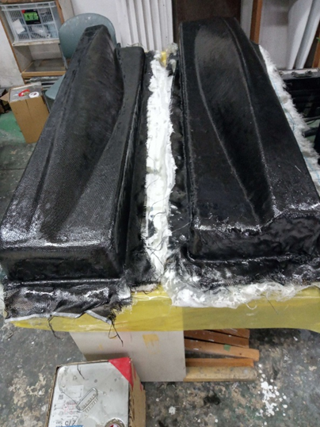

<!-- @import "[TOC]" {cmd="toc" depthFrom=1 depthTo=6 orderedList=false} -->

<!-- code_chunk_output -->

- [全体の活動報告](#全体の活動報告)
  - [サークル内行事](#サークル内行事)
    - [先端技術フォーラム(2/19,20)](#先端技術フォーラム21920)
    - [ものつくり教育研究支援センターサークル会議(3/6)](#ものつくり教育研究支援センターサークル会議36)
    - [冬旅行](#冬旅行)
  - [Apple MacのCMに出演!!](#apple-macのcmに出演)
  - [ウィンドブレーカー作成](#ウィンドブレーカー作成)
  - [新入生の方へ](#新入生の方へ)
- [プロペラ班](#プロペラ班)
- [まとめ](#まとめ)

<!-- /code_chunk_output -->

# 全体の活動報告
常連の方には、いつも読んでいただきありがとうございます。新入生の方には、合格おめでとうございます。
今月は、2月と3月初旬の活動報告とプロペラ班の紹介です。

## サークル内行事

### 先端技術フォーラム(2/19,20)
　東工大の機械系・システム制御系OB会である白星会が主催する学生・企業との交流会に参加してきました。Meisterとしてのブースを出展し、たくさんの企業様方に向けて活動内容の説明などを行いました。たくさんの寄付やアドバイスをいただき、本当にありがとうございました。

### ものつくり教育研究支援センターサークル会議(3/6)

前回(12月)と同様に、東工大に多数存在するものつくりサークルの方々と自己紹介や活動報告会、センターの利用方法等について話し合いました。 学内のものつくりサークルは東工大HPで紹介されておりますので、ぜひご一読ください。

### 冬旅行
　　入試期間中は倉庫を使えないため部員で(夏のコンテストに備えて)飛行機に乗って大阪に旅行に行き、現地の観光や料理を楽しみました。ユニバーサルスタジオジャパンではジェットコースターで旋回のGを体感したりコーヒーカップの回転数を測ったりと普段できない経験ができました。
これからの作業に備えて、部員同士の絆を深めていきました！

## Apple MacのCMに出演!!

Apple MacのCMにMeisterが出演させていただきました!
Macを駆使して挑んだ人力飛行機の設計から飛行までの軌跡が題材となっており、 2024年2⽉下旬から地上波やSNSなどの様々な媒体で放送中です。 以下のリンクからYouTubeでもご覧頂けますので是非ご確認ください!

## ウィンドブレーカー作成
　Meisterでは毎年恒例としてTシャツを作っていますが、今年はウィンドブレーカーも作成しました。色はピンクや青、サックス等各々自由に選んでメンバーの個性が現れました。
個人的には黒がイケてます⭐︎

## 新入生の方へ
　Meisterでは、来年度の部員を既に募集しています！
まずは、新歓twitterを見てみてください！

https://twitter.com/Meister_welcome

# プロペラ班
これまでの活動報告
　プロペラ班では過去の作りかたを参考にして、プロペラの雌型を自作しています。

上記の写真のように金属ポリエステルパテを用いて雄型を成形した後、frpで雌型を作ります。このfrpの積層をする作業をMeisterでは特に大積層と呼んでいます。

先日の2/29日に大積層を行いました。
 

薬品が足りないかもしれないなどのハプニングも少しありましたが…　

とてもいい感じですね　(*n’∀’)n ﾊﾞﾝｻﾞｰｲ

その後脱型をし（キレイ☆）、
 

この型を用いて外皮を積層しました!!　テンション上がりますね↗

雄型作成時の成形目安としてタシロ(株)様に加工していただいた板金を使用いたしました。また、外皮にはサカイオーベックス様に提供していただいたカーボンクロスを用いました。
この場をお借りしてあらためて感謝申し上げます。

この調子で、外皮のカーボンを積層しtf用ペラ、本番用のペラと作っていこうと思います

# まとめ

ご閲覧いただきありがとうございました。ロールアウトを間近に控え忙しいですが、頑張っていきますのでこれからもMeisterをどうぞよろしくお願いします。アドバイスやコメント等ございましたら、下記までお気軽にご連絡ください！

