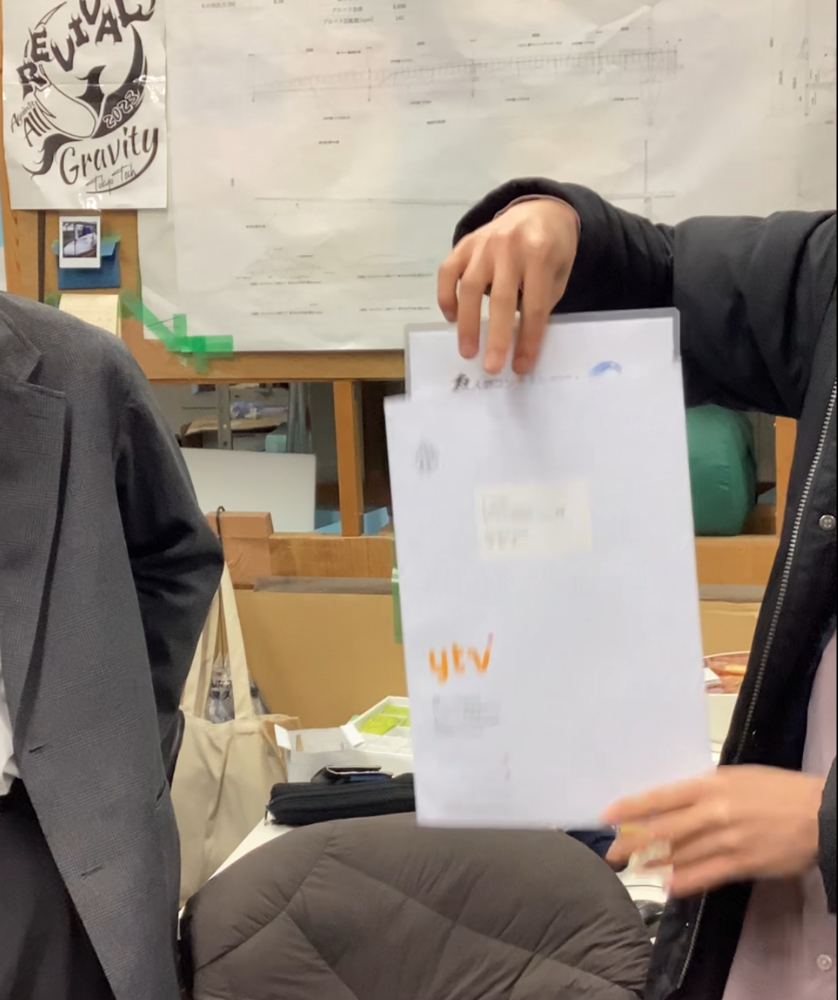

ようやく読売テレビから書類審査の結果が届きました！！！

結果は<h1>合格しました！！！</h1>

よって、第46回鳥人間コンテストへの出場が決定しました！！！

パイロットと代表、設計に意気込みを聞いてみました。

## パイロット

近年ますます中堅チームのレベルが上がってきています。meister初の旋回を成し遂げ強豪としての強さを証明するために、残り4ヶ月さらに集中してトレーニングに邁進してまいります。

## 代表

多くの方々にご協力いただき、今年も鳥人間コンテストに出場することができることとなりました。心より感謝申し上げます。
旋回という目標に向かって、Meister一丸となり準備を進めてまいります。応援のほどよろしくお願いいたします。

## 設計

荷重試験の失敗やリアスパの製作に苦戦するなどありましたが、まもなく機体が完成し飛行試験が始まります。鳥人間コンテストでの目標達成を目指して、引き続き機体の製作と調整を行いより良い機体を作っていきます。

あと４か月の間にできる限りのことをやり、今年こそは旋回を成し遂げたいと思います。応援よろしくお願いいたします！！！

2024年度電操班長 鈴木