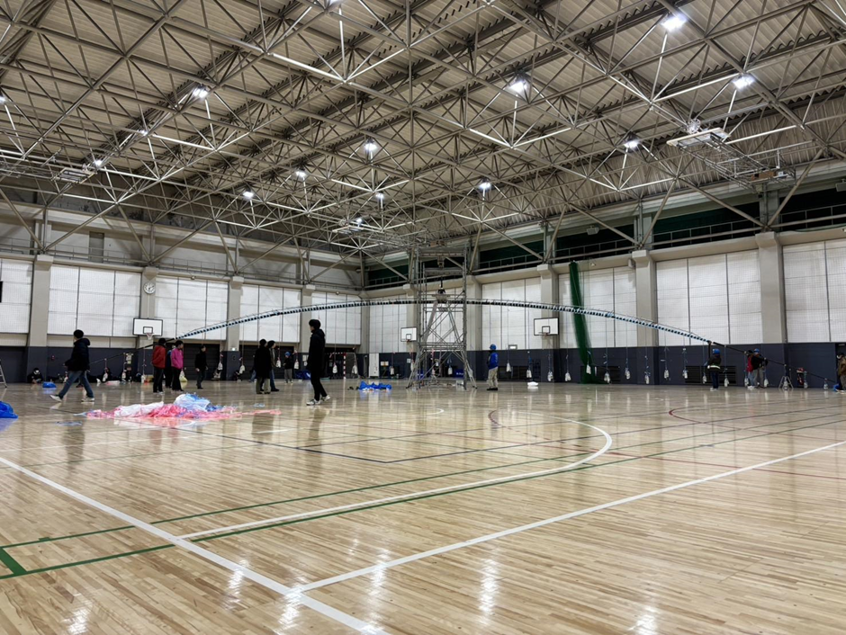
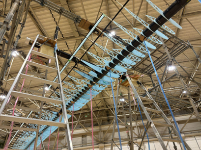
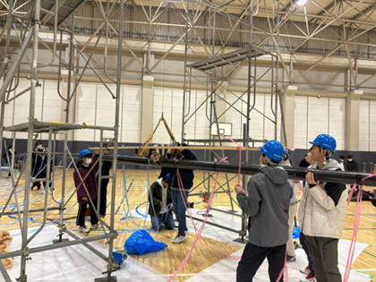
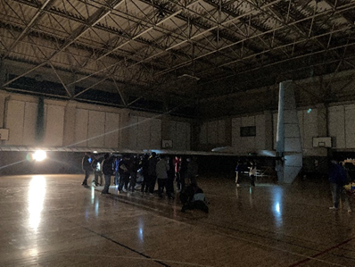
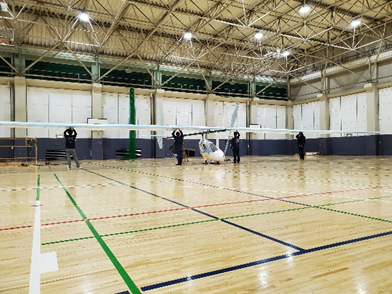
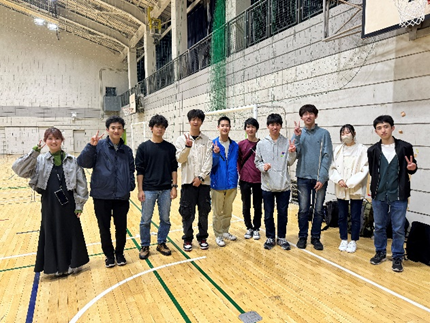
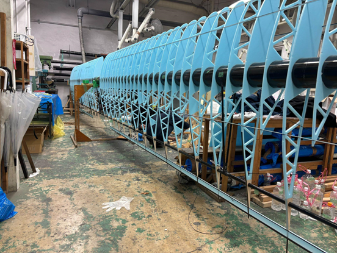
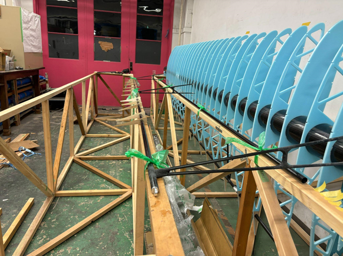

こんにちは。24代Meisterです！
新年度が始まり、新しい息吹が学内にも吹いています。
気温差が激しく体調を崩しやすい季節ですので皆さんご自愛ください。
今月は3月,4月第一週の活動報告とPフレーム班の通年の活動の内いくつかをピックアップしてまとめました。
ぜひ最後までお付き合いください。

<!-- @import "[TOC]" {cmd="toc" depthFrom=1 depthTo=6 orderedList=true} -->

<!-- code_chunk_output -->

1. [全体の活動報告](#全体の活動報告)
    1. [荷重試験 2回目](#荷重試験-2回目)
    2. [出場決定に伴う準備](#出場決定に伴う準備)
    3. [ASU](#asu)
    4. [PRONEWSでのMeister記事公開](#pronewsでのmeister記事公開)
    5. [T-MIT訪問](#t-mit訪問)
    6. [新歓活動](#新歓活動)
    7. [ご協賛のご報告](#ご協賛のご報告)
2. [Pフレーム班](#pフレーム班)
    1. [リアスパ](#リアスパ)

<!-- /code_chunk_output -->

# 全体の活動報告

## 荷重試験 2回目
3/10,11に荷重試験2回目を行いました。
そして、細心の注意を払って行ったところ無事成功しました！！
2回目の荷重試験失敗となると出場をしないという選択をしなくてはならなくなる可能性があったので本当に良かったです。

 

前回の失敗を踏まえて、従来の荷重試験の方法とは異なった方式を採用しました。

前年までは、上の写真のような吊り下げ方式でしたが、ただ吊るしているだけだったため非常に不安定でした。
そのため、特にピッチに対して常に安定した状態を保つために写真のように脚立の上にフレームを置き、翼と胴を接合した状態で行うように見直しました。

また、前回の荷重試験でねじれにより破壊してしまったことを踏まえ、翼端からおもりをかけていき、姿勢角センサーでねじり角を計測＆レーザーで前後移動量を計測して許容範囲に収まるようにセッティングを何度も調整しました。(Pフレーム)

前回の荷重試験についてはこちらを参照してください。
荷重試験 (https://meister.ne.jp/post/2023/12/9/2/)

ご協力してくださった方々本当にありがとうございました！

## 出場決定に伴う準備
3/26に読売テレビ様より書類をいただき、Meisterは第46回鳥人間コンテスト2024に出場することが決定いたしました！
代表、パイロット、全体設計のコメントを含む記事を公開していますのでまだご覧になっていない方は是非ご覧ください！
読売テレビより審査結果届きました！！ (https://meister.ne.jp/post/2024/3/28/)

出場決定に伴い、TFに向けた準備はもちろんですが本番における移動手段や宿泊施設の予約といった準備を進め始めました。

TFに向けては飛行場を貸していただくための連絡や機体の部品を運ぶためのトラックの手配、そして主にOBの方々にお願いしていますが部員の移動手段として車だしの手配をしております。
今年は車だしに関しては部員のご家族の方にもご協力いただけて本当に感謝しかありません。OBの方々も同様に、この場を借りて改めて御礼申し上げます。

本番の移動手段は基本バスと車になります。宿泊施設を含め担当のものが安く良いものを探してくれています。担当の方ありがとうございます。

## ASU
4/6,7でASUを行いました。ASUはアリーナ(体育館)にて機体を組み上げるイベントで、これを行うために4/6が各班のTFができる状態までのロールアウト期限となったために4月初旬は特に大忙しでした。
ASUでは重心測定と回転試験も行いました。
初めて組み上げられた機体を見るイベントで、組み上げられた機体を見て部員一同感動しておりました。

とてもかっこいいですね！
早くこの機体「玄鳥」が飛ぶところが見たいです！！

## PRONEWSでのMeister記事公開

電操班をピックアップしていただいたMeisterの記事をPRNEWSで公開していただきました。電操班の部員の一部はMacを使用しており、Macの活用について詳しく記載されています。今年の大会にかける思いも部員のかっこいい写真とともに書かれていますので是非ご覧ください！

<i class="bi bi-newspaper"></i> https://jp.pronews.com/column/202404021158476068.html

## T-MIT訪問

4/8に東京都立大学鳥人間部T-MIT様の作業場見学をさせていただきました。Meisterとして見学させていただくのは昨年の鳥人間コンテストが終わってから2回目となりますが今回は来年度の鳥人間コンテストに向けて製作を行う25代が主となって次代の機体製作に向けた情報交換をさせていただきました。
T-MIT様もお忙しい中ご対応していただき本当にありがとうございました。

## 新歓活動
4月に入り大学には新入生が入ってきました。Meisterでは新たな仲間を見つけるべく現2年生の25代が新歓活動を行ってくれています！
若葉祭でのイベントや電装作業体験、そして模型飛行機コンテスト等様々な新歓活動を行っています。各班の作業体験も企画してくれています。
SNSや新歓のページに詳細が乗っていますので是非ご覧ください！

- [新歓ページ](https://titechmeister.github.io/welcome/event)
- <i class="bi bi-twitter"></i>[新歓Twitter(@Meister_welcome)](https://twitter.com/Meister_welcome)
- <i class="bi bi-instagram"></i>[(@tokyotechmeister_pr)](tokyotechmeister_pr)

## ご協賛のご報告
～Honda Cars 南札幌様～
この度Honda Cars 南札幌様より応援をしていただけることになりました。
Meister応援ページも作っていただき感謝してもしきれません。
本当にありがとうございます。
Honda Cars 南札幌様は本田技研工業の自動車販売におけるディーラー網でありカ最高のカーライフを支えてくれています。
こちらがMeister応援ページとなります。こちらからHonda Cars 南札幌様の情報もご確認できますので是非ご覧ください。

<i class="bi bi-newspaper"></i> https://www.hondacars-minamisapporo.co.jp/campaign/topics-detail.html?shop=91&num=001108

# Pフレーム班

こんにちは！Pフレーム班です。

Pフレーム班は翼やコックピットの骨組みを製作している班です。パイロットの命に直結するので楽しみつつも気を引き締めて活動しています。

活動報告として、荷重試験とリアスパについて書きました！(荷重試験は前に記載されています。)

## リアスパ

今年度、Meister初のリアスパを導入いたしました。

主桁と別に横に1本通っているのが「リアスパ」、主桁とリアスパを繋ぐのが「ブリッジ」、ブリッジのたわみ・三角形のつぶれを防ぐために横切っているのが「ジブリ」です。

リアスパ製作の主な流れは、やすり、エポ止めして、パテを盛り、オーバーレイを行います。今年度は、A,BR,BL,CR,CLの5つの翼にリアスパを相貫したため5回同じ作業を繰り返しました。オーバーレイした箇所は合計で90箇所！

初めてのリアスパということもあり、勿論いろいろ問題が起こり、写真のようにオーバーレイまでしたブリッジを全て取り外したり、Cまでリアスパを入れるのを断念しようとしたりしたことも、、、

←取り外されたブリッジ泣

いろいろ問題がありましたが、とりあえず完成できて良かったです！
最後に推しの写真です。肉抜きにリアスパが干渉せずに全て通っているのがいいですね！
 
 

　以下Meisterの連絡ツールとなります。アドバイスやご相談などがありました下記のいずれかによろしくお願いいたします。
- <i class="bi bi-newspaper"></i>[こちらのサイトの掲示板](https://meister.ne.jp/bbs/index.rb)
- <i class="bi bi-twitter"></i>
[Twitter DM(@titech_meister)](https://twitter.com/titech_meister)
- <i class="bi bi-instagram"></i>
[Instagram DM(@tokyotechmeister)](https://www.instagram.com/tokyotechmeister/)
