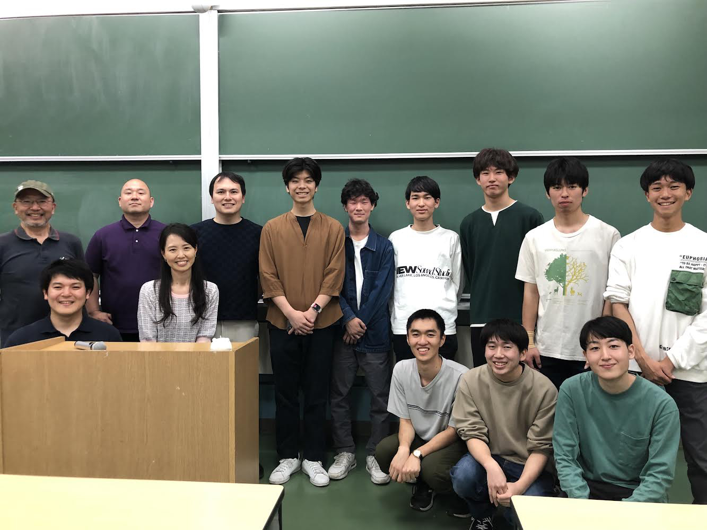

<!-- @import "[TOC]" {cmd="toc" depthFrom=1 depthTo=6 orderedList=true} -->

<!-- code_chunk_output -->

1. [全体の活動報告](#全体の活動報告)
    1. [Miro Japan様からの取材依頼(4/11)](#miro-japan様からの取材依頼411)
    2. [1st TF(4/19-20)](#1st-tf419-20)
    3. [2nd TF(4/26-27)](#2nd-tf426-27)
    4. [3rd TF(5/3-4)](#3rd-tf53-4)
    5. [Meister OB、OG様、航空会社ANAの社員様への倉庫ご案内(5/6)](#meister-ob-og様-航空会社anaの社員様への倉庫ご案内56)
2. [全体設計より](#全体設計より)
    1. [「玄鳥」三面図](#玄鳥三面図)
    2. [機体について](#機体について)
        1. [一次構造](#一次構造)
        2. [二次構造](#二次構造)
    3. [設計について](#設計について)

<!-- /code_chunk_output -->

# 全体の活動報告

## Miro Japan様からの取材依頼(4/11)

Miro Japanの方々からMeister部員が取材を受けました。東工大Meister２４代では、各班の相関図やコンセプトまとめ、TFなどの各イベントの振り返りを部員全員で共有しあい、書き込めるようにMiroを活用させていただいております。そこで、Miro　Japanの方々からMeister内でどのようにMiroを活用しているのか、どのような機能が便利かなどを取材していただきました。また、Miro Japanの皆様からMeisterへご支援もしていただきました。今回はとても貴重な機会を準備していただき、ありがとうございました。
 

## 1st TF(4/19-20)

4/19-20に富士川滑空場にて、24代初の飛行試験（TF）を行いました。当日は天気には恵まれたものの、滑走路を横切るような強風が吹き付け、メニューとしては転がし、滑走までの飛行試験となりました。また、セットアップやTF運用にも見直しが必要な点も発見でき、課題を多く発見したTFとなりました。　
-	一本目　転がし
グラウンドクルー（GC）の動きを確認しました。

-	二本目　滑走
初めての滑走であったために、速さを抑え気味の滑走となりました。

-	三本目　滑走
二本目に比べて機体の速さを速くしようとしました。翼側から強い横風が吹き、機体がロール、ヨー方向に大きく崩れました。風が強いことを認識し、今回のTFでは速さを抑えてGCの練習として滑走を行うことにしました。

-	四本目　滑走
三本目で横風が強いことがわかったため、小走り程度の滑走を行いました。ジャンプができる風になるまで、GCの訓練の訓練をするべきであると判断しました。

-	五本目　滑走
四本目と同じく小走り程度の滑走を行いました。

## 2nd TF(4/26-27)

4/26-27に二回目のTFを富士川滑空場で行いました。二回目は初回よりも天気がよく、また、風もほとんど無風状態のTF日和になりました。初回ではできなかったジャンプ、そして短距離までの飛行試験を成功させました。
-	一本目　転がし
GCの動きの復習、ウォーミングアップとして転がしをしました。

-	二本目　滑走
一本目の転がしを踏まえ、滑走を行いました。

-	三本目　滑走（ジャンプ）
三本目はもう一度滑走を行って、段階を踏む予定でしたが、機速が速くなりすぎてしまい、車輪が滑走路上を回転する音が聞こえなくなるほど、機体に揚力がかかりました。
-	四本目　ジャンプ
三本目の滑走でやるべきこと、確認するべきことが達成できたと判断し、ジャンプを行いました。機体は浮き上がったものの、ピッチが少し下がり気味であることを確認しました。

-	五本目　短距離
四本目での機体のピッチが少し下がっていたので、尾翼のトリムを上げました。しかし、まだ少しピッチが下がっている状態で、前輪が下がり気味でした。

-	六本目　短距離
尾翼のトリムを上げましたが、まだピッチが下がってしまっていました。

-	七本目　短距離
七本目の短距離では両輪同時浮上を達成し、着陸も前輪後輪ほぼ同時でした。そこで、今回のTFでの尾翼のトリムを確定させました。

-	八本目　短距離
確定させたトリムで飛行しました。中距離を飛ぼうか迷いましたが、パイロットとともに事前に決めていた目標が短距離であったため、もう一度短距離を飛行しました。

## 3rd TF(5/3-4)

5/3-4に富士川飛行場にて、三回目のTFを行いました。天気はよかったものの、朝方に向けて風が強くなり、飛行回数、飛行距離を思っていたより増やすことができませんでした。しかし、TFの運用にも慣れ始めて、８本飛ぶことができました。飛行距離を伸ばせなくても学びが多いTFとなりました。
-	一本目　転がし
GCの復習、ウォーミングアップのために転がしを実施しました。

-	二本目　滑走
滑走を行いました。向かい風が強かったので、プロペラの回転数は抑え気味で滑走しました。

-	三本目　ジャンプ
三本目のジャンプでは尾翼のトリムを再び確認しつつ飛行しました。機体のピッチが少し下がり気味でした。

-	四本目　短距離
尾翼のトリムを三本目より上げて飛行しました。短距離を飛行する予定でしたが浮上後、再接地してしまい減速しました。

-	五本目　短距離
五本目も浮上後に再接地してしまい、ピッチが下がっていることが確認できました。

-	六本目　ジャンプ
尾翼のトリムを変更し、トリムの確認を行うために、ジャンプを行いました。両輪同時に離陸できましたが、前輪から着陸する飛行となってしまいました。また、パイロットから無意識にスロットルを落としてしまっているという感想も得られました。

-	七本目　ジャンプ
離陸後にパイロットが出力を調整する練習を行うために少し浮上時間を長めにするジャンプを行いました。今回のフライトでは2ndTFのように垂直に浮上することができました。

-	八本目　短距離
風が少し弱くなったので、距離を伸ばして飛行しました。今回もパイロットが出力を意識できるように浮いている時間を伸ばそうとしました。

 
## Meister OB、OG様、航空会社ANAの社員様への倉庫ご案内(5/6)

ANAにてご活躍されていらっしゃるMeisterのOB、OGの方々とANAの社員様が倉庫を見学しに来ていただきました。人力飛行機の桁の材料となっているCFRPのお話などとても面白いお話をしていただきました。また、優勝代の先輩とお話し、とても刺激的でした。ご訪問ありがとうございました。

# 全体設計より
こんにちは。24代全体設計の伊藤です。ブログということで、せっかくなので今まで正式には公表していなかった今年の機体と設計について、詳しく書きたいと思います。
## 「玄鳥」三面図

## 機体について
今年の機体は特に**主翼構造**にこだわって、これまでとは大きく変更しました。  

### 一次構造
まず第一に主桁のみの一次構造から脱却し、リアスパを採用しました。  

  

前後方向の剛性を効率的に稼げるだけでなく二次構造の支持材にもなり、翼間接合精度も上げられる優秀な構造です。予期せぬトラブルもあり製作は難しいものでしたが、ｐ班が頑張って作ってくれました。詳しくは[3月活動報告](https://meister.ne.jp/post/2024/4/09/#p%E3%83%95%E3%83%AC%E3%83%BC%E3%83%A0%E7%8F%AD)に。

翼根桁にはMeisterの伝統であるΦ135超大径パイプを数年ぶりに復活させました。
　　
さらに昨年確立させた技術である斜めかんざしをBC間に採用し、3degの途中上反角を入れました。  
  
これらにより高い上下方向の剛性をもちつつも十分な上反角を持つ操縦性の良い機体となりました。

↑ 04/27 2ndTF 　　かっこいい！！
  
### 二次構造
翼の二次構造はフィルムの翼型再現・表面精度、そして空気力を桁（機体）に伝えるための構造です。  
まずは表面精度を高めるために、今年はある程度の硬さがあるかつ熱収縮しやすいフィルムを使用しました。  
昨年まではほとんど熱収縮をさせていなかったため、翼もフィルムテンションに耐えうる構造に変える必要がありました。  
そこでエンドリブを肉抜きなしの16mm厚にし、軸方向のテンションに負けないようにしました。
また後縁は非常に弱かったため、他チームの多くも採用しているバルサ強化板を採用しました。  

　　

そして桁から後縁にかけてかかる空気力を効率的に主桁に伝達するためにリブキャップを前縁プランクエンドまで伸ばし、また先述したバルサ強化板とリアスパを接着することでリブにかかる剪断力の多くをリアスパを介して主桁に伝えるような構造にしました。これによってリブの変形を大幅に抑え、厳しい環境でも性能を維持できるようになりました。  
またうれしいことに、バルサ強化材により後縁材取り付けの精度を確保でき、後縁がびしっと揃う美しい翼を作ることができました。

## 設計について

昨年の全体設計から主翼設計用プログラムを引継ぎ、新しい機能の開発を続けています。  
主翼桁は今まで上下方向のたわみのみあるものとして計算していました。しかし、現在人力飛行機で一般的な破壊原因はねじりによるものです。  
そこで上下だけでなく前後・ねじり変形も含めた桁のたわみ・ねじりによる空力変化を加味した統合的な主翼空力構造解析プログラムを開発しました。

これにより主翼の静的な特性を知ることができるようになりました。  
これからは、微小擾乱理論を用いた線形動解析や、慣性力と機体全体の運動を考慮したシミュレータなどの機能を実装し、設計に反映させることを目指しています。