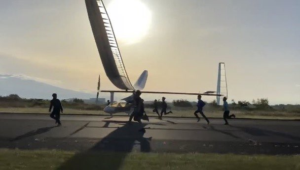
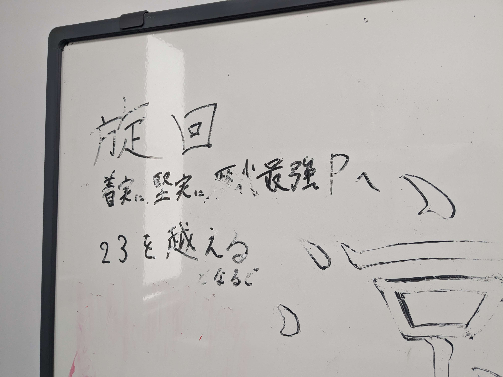
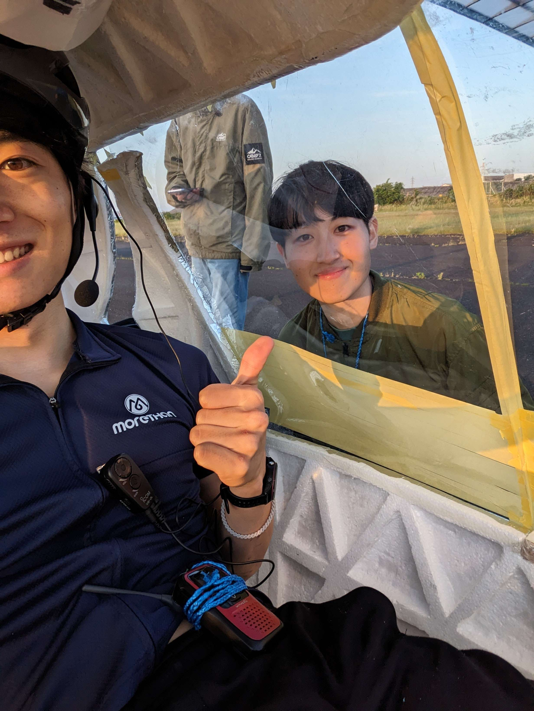

こんにちは。Meister24代です！ 
今月5月の活動報告に加えて24代パイロットの鈴木涼介が普段のトレーニングと最近のTFでの所感についてまとめてくれたものを掲載していますので是非最後までご覧ください。必見です！

目次
<!-- @import "[TOC]" {cmd="toc" depthFrom=1 depthTo=6 orderedList=true} -->

<!-- code_chunk_output -->

1. [全体の活動報告](#全体の活動報告)
    1. [4th TF(5/11-12)](#4th-tf511-12)
    2. [5th TF(5/24-25)](#5th-tf524-25)
    3. [ホームカミングデイ(5/25)](#ホームカミングデイ525)
    4. [6th TF(6/7-8)](#6th-tf67-8)
    5. [仮班所属始動](#仮班所属始動)
2. [パイロットの日々](#パイロットの日々)
    1. [はじめに](#はじめに)
    2. [歴代最強のパイロットを目指して](#歴代最強のパイロットを目指して)
    3. [トレーニングボリューム](#トレーニングボリューム)
    4. [トレーニング理論](#トレーニング理論)
    5. [TF](#tf)
3. [まとめ](#まとめ)

<!-- /code_chunk_output -->

# 全体の活動報告
5月はTF日和の日が多く、雨が要因となってTFが予定通りに出来ないということもなく順調に経験値を積むことが出来ました。 
5月末には期末試験があり大学生として学業が忙しい時期もありましたが、全員おそらく何とか乗り越えることが出来ました。

## 4th TF(5/11-12)
5/11-12に4回目のTFを富士川滑空場にて行いました。当日は天気に関しては問題なく、フライトを9本行い短距離の飛行試験の本数を稼ぐことが出来ました。セットアップ中に副桁の接合部が抜けるというアクシデントもありましたが、パイロットの経験値を今まで以上に積めた上、操舵関連でも改善点が見つかり、実りの多いTFとなりました。

- 一本目　転がし　GCの動きの復習、ウォーミングアップのために実施しました。
- 二本目　滑走　問題なく行うことが出来、GCの動きの復習、ウォーミングアップにもなりました。
- 三本目　ジャンプ　浮いてから急激に機体を落とさないように出力を調節することに成功しました。
- 四本目　ジャンプ 　パイロットとGCの認識の違いを修正してのフライトとなりました。パイロットから横方向の操舵に対する躊躇いもなくなってきたという感想を得られましたが、高度が低い分、テールがスターターにあたりそうになりGCに改善の余地がみられました。
- 五本目　短距離　滑らかなスロットル管理ができましたが指示出しを行っている全体設計との意思疎通について少し問題がみられたので話し合い、改善を行いました。
- 六本目　短距離　滑らかな横方向の操舵は徐々に出来てきたので、滑走路に対する相対的な位置を意識してフライトを行いました。
- 七本目　短距離　ジャンプより高度がある分、落ち着く時間があり、細かい操舵が出来ている感覚をつかむことが出来ました。減速して機体を落とす際に落ち着いて機首を直せたのが良い点でした。
- 八本目　短距離　距離は抑えめで練度を高めるために実施しました。トリムがあっていない可能性が浮上しました。パイロットからは高度が十分にあれば対応できたという感想を得られました。
- 九本目　短距離　ペダルを回しても回しても高度が維持できずトリムの問題ではないかという結論に至りました。時間がなく調整後のフライトはかないませんでしたが改善点が見つかって良かったです。

今回のTFで短距離フライトを多く行えて、TFのフライト回数にある程度余裕を持てることになりました。そのため機体製作において改善すべき点をしっかりと改善するべく翌週のTFは見送る判断を下しました。また、滞り気味のTシャツデザインもこの期間で片付けることにしました。 
具体的には主に以下の通りです。 
翼　「翼フィルムの熱収縮とその修復」「主翼チップ製作」「破損したリブの修復」 
フェアリング　「ダクト調整」 
駆動　「クランク接着固定」 
ペラ　「スピナー・フィレット製作等」 
電操　「ピトー管再接着」「回転数の校正」「風見計・高度計の製作と改善」「シミュレーター開発」等

## 5th TF(5/24-25)
5/24-25に5回目のTFを富士川滑空場にて行いました。時折風が強く吹くような日ではありましたが大きな問題なく飛行距離を延ばすことに成功しました！ 
6月からは埼玉県の飛行場を借りることになりましたのでこれがおそらく最後の富士川でのTFとなると予想され部員各々が富士山のあるきれいな景色の写真をたくさん撮っていました。 
関係者の皆様、富士川滑空場を貸していただきありがとうございました。

- 一本目　転がし　前回同様GCの動きの復習、ウォーミングアップのために実施しました。
- 二本目　滑走　前回同様問題なく行うことが出来、GCの動きの復習、ウォーミングアップにもなりました。
- 三本目　ジャンプ　向かい風が強く簡単に浮きました。ここでトリムを少し下げる判断を下しました。
- 四本目　ジャンプ 　想定より浮かなかったため徐々にパワーを上げ350w以上でようやく浮きました。着地後に機体がロールしており翼紐をかなり引っ張って直すことになりました。ここから機体が落ちてからもある程度流すことで翼紐を引っ張る時間を多めにとることになりました。
- 五本目　ジャンプ　トリムの調整を行い再度ジャンプを実施。離陸で使いませんでしたが水平尾翼の操縦にも挑戦しました。
- 六本目　短距離　距離を延ばすことで水平尾翼の操縦を行う機会を作るために短距離へ移行しました。左からの風によって偏流しており偏流飛行の経験を積むことができました。
- 七本目　短距離　水平尾翼を使っての高度維持に成功しました。また偏流飛行の経験をさらに積むこともできました。
- 八本目　中距離　短距離で挑戦することがなくなったので次のステップに移行しました。水平尾翼を操作することで浮かし、高度を出しての飛行となり良い景色だったという感想がパイロットから出ました。
- 九本目　中距離　離陸時にピッチが上がりすぎ、滑走中に右ロールしていたことで右に大きく滑るフライトとなりました。フルでラダーをきる経験を積むことになりました。結果的に滑走路中心で着地することになりましたが操舵量指示ミスもあり焦るフライトとなりました。
- 十本目　中距離　エレベーターを使用して機体を浮かせる練習としました。大きな問題なくフライトを終えることが出来ました。

翌週は試験期間に被ってしまうためTFは実施しないことになりました。


## ホームカミングデイ(5/25)
5thTFの直後にはホームカミングデイがありました。ホームカミングデイは大学が主催する年に1度の交流イベントで、卒業生の方にとっては同窓生や先輩、後輩、恩師と旧交を温める、在学生にとっては卒業生との貴重な交流の機会となる、近隣の方々にとっては、東工大について知っていただく1日です。 
Meisterとしてはこのホームカミングデイで東京工業大学工学院機械系のOBの方で主に構成されている白星会の方の総会の前に場所をお借りして機体部品の展示とその説明をさせていただく機会をいただきました。総会開始後は作業場にて作業場見学を行い、多くの方にMeisterをより知っていただくことが出来ました。募金に加え、グッズ販売や今年度のチームTシャツの先行予約も実施し、一般の方々にもMeisterを応援していただくことが出来ました。 
ホームカミングデイにて説明を聞き応援してくださった方々ありがとうございました。

## 6th TF(6/7-8)
6/7-8に6回目のTFをホンダエアポート様の桶川市の滑走路をお借りして行いました。ほぼ無風で天気も良く最高のTF日和でした。飛行試験も問題なく本数を稼げ、距離も十分のばしてフライトが行えたのでパイロットが挑戦するべきことはほとんど達成できたといえるほど成果を得られたTFとなりました。

- 一本目　滑走　GCの動きの復習、ウォーミングアップのために実施しました。
- 二本目　ジャンプ　水平尾翼を使わないと高度を出すのに苦労することを再確認。特に問題なく成功しました。
- 三本目　短距離　水平尾翼を使うために短距離フライトを行いました。特に問題なく成功したため次のステップに入ります。
- 四本目　中距離　飛び切りを行う前段階として一旦中距離を行いました。問題なく飛べたため滑走路ほぼ全域を飛ばしきる飛び切りに移行しました。
- 五本目　飛び切り　初めての飛び切りで今まで得たことを全て出し切る気持ちで臨みました！特に問題なく飛び切りに成功することが出来ました！
- 六本目　長距離　飛び切りに成功したのでトリムを動かす練習として飛び切りより短いが高度のある長距離を実施。まずは触ってみることを目的にしました。
- 七本目　長距離　引き続きトリムに触ることを目的としました。着地した後に想像以上に速度が落ちずGCが水平尾翼に頭をぶつけてしまいましたが、けがも破損もなかったです。
- 八本目　長距離　ダウントリムを試すことを目的に長距離フライトを実施しました。
- 九本目　長距離　八本目の目的が達成されたので計器を今まで以上に落ち着いてしっかり見ることを目的にしました。駆動系のメンテナンスをする必要性が出てしばらくフライトが中断しました。
- 十本目　C字飛行　トリムの操作も十分に出来、落ち着いて状況把握も十分出来たと判断し、C字飛行に挑戦しました。わざと垂直尾翼を切って曲がる飛行を行い、問題なく成功することが出来ました。

非常に充実した試験飛行となりました。パイロットの練度はかなり上昇したといえるので製作をさらに進めてよりパイロットが快適に琵琶湖の空を飛べるように努めてまいります。



## 仮班所属始動
今年度は現状20名の新入生がMeisterの仲間になってくれました！ 
いかに良い新歓にするかを考え様々なことを実践し、新歓活動を熱心にやってくれた25代に感謝しています。 
6/10(月)から2026年度に機体を飛ばす代となる26代の仮班所属期間がスタートしました。26代の学生たちはこの期間に自分の興味のある班の活動を体験して実際にどの班に入りたいか希望を出すことになります。
24代にとっては本番が近づいてきていてラストスパートをかける時期となりますが、それと同時に新しい鳥人間が誕生していることに喜びを隠せません！ 
26代以降も含め、これからもMeisterの応援をどうぞよろしくお願いいたします。

# パイロットの日々
## はじめに
24代パイロットの鈴木涼介です。 
meister初の旋回という高い目標を実現するために、練習量だけは誰にも負けないように意識してトレーニングを重ねています。 
今回は普段のトレーニングと最近のTFについて少し紹介させていただきます。

## **歴代最強パイロット**を目指して
最強のエンジンを目指してきました。今年のエンジンは他のパイロットと比べてがっしり筋肉質系で重めです。 
恐らくこの体格は重力と戦う鳥人間向きではないですし、華奢なパイロットを羨ましく思ってしまうことも多いです。 
しかし、悩んでもどうにもならないので、大きな絶対値のパワーを生み出せるポテンシャルを自分の強みと捉えてトレーニングに励んでいます。 
普段特に意識しているボリュームと理論について紹介します。

## トレーニングボリューム
最近のパイロットはインフレが進んでいて、なんとなくトレーニングをしているだけでは平凡なエンジンに落ち着いてしまうことは明白でした。 
meisterの歴代パイロットの課題として、走り込みが圧倒的に足りていないことが挙げられます。そこで今年は、外での走り込みを重視して誰にも練習量は負けないことを目標としてきました。 
具体的には、大学まで往復60kmの道のりをロードバイクで通学したり、週末に100～200kmほど山道を走りこんだりしています。 

## トレーニング理論
練習のボリュームと同等に意識しているのが、理論に基づいてトレーニングをすることです。 
自分で試行錯誤しているうちにすぐ引退することになりそうだったので、トレーニング理論を徹底的に調べました。なんとなく気分でメニューを決めるのではなく、多くの先人が成功してきた王道から外れないように練習計画を立てる意識をしています。
自転車のトレーニングの情報源は英語が多く、読み込むのに時間がかかりましたが、ある程度道筋を示して将来のパイロットが試行錯誤する時間をなくしていくことを目標に勉強しています。**meisterのエンジンづくりに再現性**をもたせていきたいです。

## TF
テストフライトでは自分の感覚を言語化して、操縦時の思考方法を洗練させていくことを目指しています。 
今年はロールアウトを早い時期にして達成してくれた優秀なチームメンバーのおかげで、丁寧に操舵練習を進めることができています。本当に思った通りに機体が動いてくれるので、事故もなく楽しみつつ経験がつめていると思います。部員には感謝しかありません。 

**記録と記憶に残るフライト**のために、精一杯自分にできるすべてを尽くして参ります。残り2ヶ月を切りましたが、今後とも24代を応援のほどよろしくお願いいたします。

# まとめ

ここまでご覧いただきありがとうございました。Meisterの活動はこれからも続いていきますので繰り返しになりますが応援のほどよろしくお願いいたします。
また、試験飛行(TF)の動画はYoutubbeアカウント"Meistermovie"にて公開しておりますので是非ご覧ください。

Meistermovie <i class="bi-bbs"></i>：[@Meistermovie](https://www.youtube.com/user/Meistermovie)

何かアドバイスなどありましたら下にまとめてある連絡ツールによろしくお願いします！

Twitter <i class="bi-twitter"></i>：[@titech_meister](https://twitter.com/titech_meister)

Instagram <i class="bi-instagram"></i>：[@tokyotechmeister](https://instagram.com/tokyotechmeister)

掲示板 <i class="bi-bbs"></i>：[https://meister.ne.jp/bbs/](https://meister.ne.jp/bbs/index.rb)