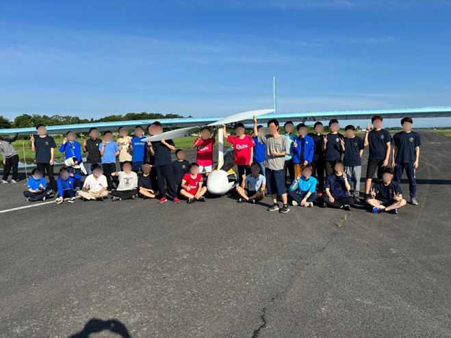
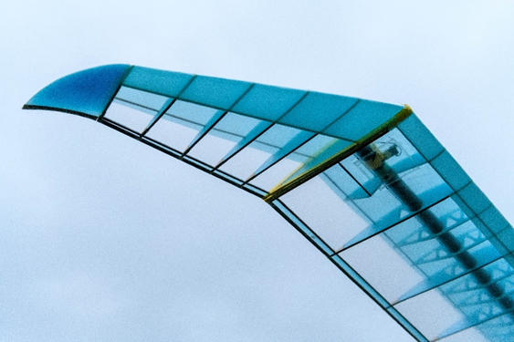
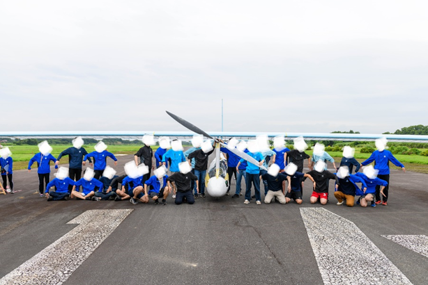

<!-- @import "[TOC]" {cmd="toc" depthFrom=1 depthTo=6 orderedList=true} -->

<!-- code_chunk_output -->

1. [6月活動報告](#6月活動報告)
    1. [7thTF(6/21-22)](#7thtf621-22)
        1. [一本目　滑走](#一本目-滑走)
        2. [二本目　短距離](#二本目-短距離)
        3. [三～五本目　中距離](#三-五本目-中距離)
        4. [六～九本目　飛び切り](#六-九本目-飛び切り)
    2. [8thTF(6/28-29)](#8thtf628-29)
        1. [一本目　滑走](#一本目-滑走-1)
        2. [二本目　短距離](#二本目-短距離-1)
        3. [三本目　中距離](#三本目-中距離)
        4. [四本目　中距離](#四本目-中距離)
    3. [五本目　飛び切り](#五本目-飛び切り)
    4. [鳥人間コンテスト2024大会　最終説明会参加(6/23)](#鳥人間コンテスト2024大会-最終説明会参加623)
    5. [7minutes参加(6/27)](#7minutes参加627)
2. [代表活動報告](#代表活動報告)
    1. [桁の自作方法の確立](#桁の自作方法の確立)
    2. [広報活動、交流の充実](#広報活動-交流の充実)
    3. [企業との関係性構築、強化](#企業との関係性構築-強化)

<!-- /code_chunk_output -->

---

今月のブログは6月の活動報告と代表の紹介となります。

# 6月活動報告

## 7thTF(6/21-22)

6/21-22にホンダエアポートにて、7回目のTFを行いました。今回のTFは公開TFとして行い、東工大の機械系、システム制御系の同窓会である白星会の方々やMeisterのOB、OGの方々がTFを見に来てくれました。公開TFにお越しくださった皆様、ありがとうございました。また、今回のTFから電操班の尽力により、TFで得た電装系のデータのログとTFの動画が合成されて、YouTubeにアップされています。ぜひ、ご覧ください！！
Meistermovie ：@Meistermovie

### 一本目　滑走

GCの確認を行いました。また、今回TFからキャノピー（窓）に遮光フィルムを貼ったので、パイロットに周辺がしっかり見えるか確認してもらいました。

### 二本目　短距離

短距離を飛びました。２週間ぶりのTFでしたが、操縦、GCの動きともに問題なく行えました。

### 三～五本目　中距離

中距離を飛びました。非常によく安定した飛行を行なえました。

### 六～九本目　飛び切り

飛び切りを飛びました。非常によく安定した飛行を行なえました。八本目と九本目は本番の鳥コンを見据えて、スターターを3人にして発進しました。右翼、左翼、テールのそれぞれのプッシャーにとって3人での発進は初でしたが、安定して浮上させることができました。

 

## 8thTF(6/28-29)

今回が24代最後のTFとなりました。翼端のウイングチップ、翼根フェアリング等を取りつけ、様々な電装部品を実装し、限りなく本番に近づけた状態で最終TFを行いました。直前の28日の深夜ごろまで雨が降っていて、心配な部分もありましたが、日付をまたぐあたりになると、すっかり雨がやみ、セットアップを進めることができました。
　今回のTFでは飛行試験を行う前に、鳥コン本番のプラットホームの助走路10mを想定したスターター練習を行いました。スターターが落下してしまうと失格となってしまうので実際に機体を保持し、助走路を走る良い経験になりました。

###	一本目　滑走

滑走を行いました。GCが雨に濡れた地面に足を滑らせ、転倒し、機体がロールしてしまいましたが、幸い怪我もなく、機体も大きな破損はありませんでした。

### 二本目　短距離

短距離を行いました。安定して飛行することができました。

### 三本目　中距離

中距離を行いました。今回はウイングのスターターが鳥コン本番に何らかの原因で参加できなかった場合に備え、予備スターターの練習も兼ねました。無事に飛行することができ、スターターが変更になっても安全に発進できることがわかりました。

### 四本目　中距離

中距離を行いました。ウイングのスターターをいつものメンバー配置に戻し、テールのプッシャーを予備のプッシャーに変えて飛行しました。今回も無事に飛行することができ、テールのプッシャーが本番に来られなくなってしまっても、安全に発進できることがわかりました。

## 五本目　飛び切り
スターターを全員通常の配置に戻し、飛び切りを行いました。これが24代最後の飛行試験となりました。少し風が強かったですが、最後にふさわしい安定した飛行でした。

 
機体名であり、東工大のシンボルとなっているツバメのポーズです！！

全8回の2024年度のTFもこれで終了です。車だしや差し入れ、アドバイス等をしてサポートしてくださったOB、OGの皆様、本当にありがとうございました。皆様のおかげで本番に向けてTFを重ね、機体、パイロットともに万全の状態にすることができました。鳥コン本番の応援もよろしくお願いいたします！！

## 鳥人間コンテスト2024大会　最終説明会参加(6/23)

　鳥人間コンテストの最終説明会を大学の講義室を借り、部員みんなで見ました。本番に向けて細かな注意やルールを聞きました。部内でもう一度ミーティングを行い、部員全員が注意事項を熟知した状態で琵琶湖に迎えるようにします！！

## 7minutes参加(6/27)

7minutesとは7分間で学生団体が、自分たちの活動を企業の方々にプレゼンし、応援したいと考えてくださった企業様がいらっしゃった場合、支援が受けられるという株式会社DYM様が主催のイベントです。さらに、プレゼンの順位によって賞金がでるプレゼン大会でもあります。鳥人間コンテストに出場するために必要な機体の製作費、TFや琵琶湖への移動費など年間多額のお金が必要になります。そのため、7minutes参加のご招待をしていただき、賞金獲得、ご支援のお願いを目標にプレゼンをしてきました。Meisterとしては初の挑戦であったので、上手くいかなかった点は多々ありますが、今後も参加させていただき、たくさんの方々に人力飛行機の面白さを広め、企業様と素敵なご縁を獲得できるよう頑張ります！

# 代表活動報告

２４代代表の山﨑翔太です。事故なくテストフライトも終え、鳥人間コンテスト本番まで残すところあと十日となりました。全体設計、各班主任をはじめとして部員全員で製作してきた機体と、最高のパイロットで、必ず「旋回」という目標を達成できると確信しています。
　今回のブログではものつくりからはいったん離れて、２４代として「挑戦し続けられるチーム」づくりのために行ってきたことを紹介させていただきます。
　
## 桁の自作方法の確立

近年MeisterにはCFRPの桁を自作するために必要な熱硬化のための作業を行うことができませんでした。しかし、２３代が昔とは別の方法での熱硬化に成功しました。そして我々２４代では専門の先生にご意見を頂きながらより安全に、そして大学に申請し学内での実施が許可されたためより気軽にこの熱硬化の作業を行うことができるようになりました。そのため様々な太さ、形の桁の熱硬化作業の知見を得ることができ、後輩へと伝えていくことができました。先日はいままでは外注していた部分の桁を後輩の２５代が試作しており、彼らの挑戦の幅を広げることができてうれしく思っています。

## 広報活動、交流の充実

OBさんなど様々な大人の方とお話させていただく中で、Mesiterは今何をやっているのか、何に挑戦しているのかもっと知りたいというお声を多くいただきました。そこでたくさんの方に応援いただくため広報活動を充実させることにしました。具体的には、ホームページのリニューアル、充実した内容のブログの投稿、X（ツイッター）と新しく開設したInstagramへの高頻度の投稿などです。またOB交流会や総会の復活、TFの公開など直接交流できる機会も増やすことができました。OBさんや地域の方、企業からご連絡いただくことも確実に増え、知名度の向上、そして応援してくださる方の増加をわずかながらも感じています。皆様の応援は挑戦する部員の力になります。

## 企業との関係性構築、強化

挑戦にはお金もかかります。また近年の物価高騰による支出の増加という問題もあり、以前よりも多くの企業様へご協賛や材料のご提供のお願いをさせていただきました。その結果たくさんの企業にご協力いただくことができました。改めてお礼申し上げます。また資金面でとても助かったのはもちろんですが、企業とのお金以外の関係の大切さにも気づかされました。直接お話させていただいたなかで何度か伝えられたのは、「お金だけじゃないもっと深い関係になれたら」。社員さんとの交流や、技術的なご協力を頂くなどつながり方はたくさんあると思います。後輩たちには、様々な企業と多種多様な関係をつくり、サークル活動に生かせるよう頑張ってほしいなと思います。

多くの部員・OBさん・関係者の皆様のご協力があり、運営面でもMeisterは大きく成長できた年になったのではないかと思います。この場をお借りして感謝申し上げます。
あとは琵琶湖の空を１秒でも長く飛び、皆様に恩返しをするのみとなりました。ぜひ我々のフライトにご期待ください！
