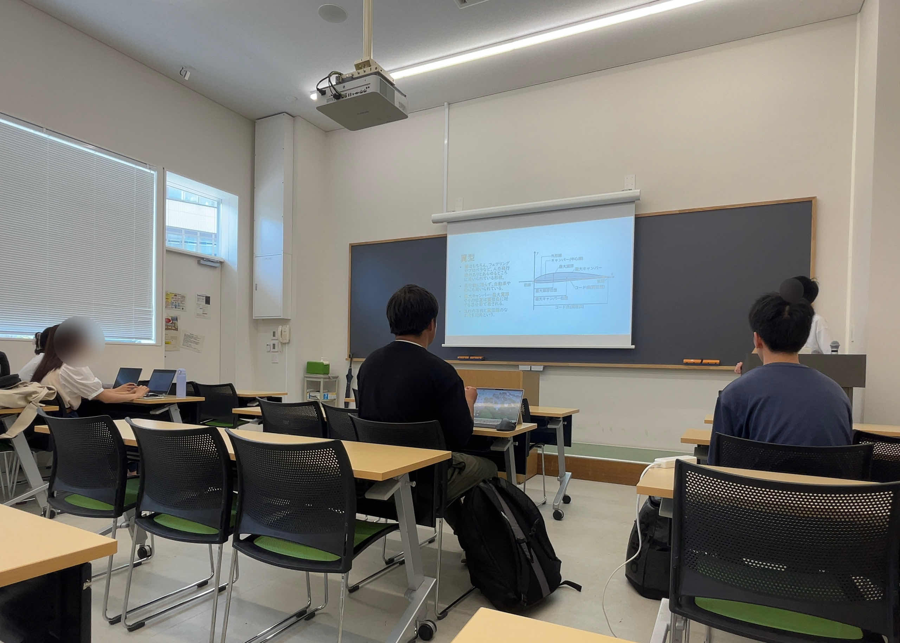

こんにちは！東京科学大学Meister25代フェアリング班主任を務めさせていただいている者です。

今回は、鳥人間コンテスト本番前から9月にかけてのフェアリング班の活動報告をさせていただきます。

- [鳥人間コンテスト本番まで](#鳥人間コンテスト本番まで)
- [夏休み](#夏休み)
- [最後に](#最後に)

## 鳥人間コンテスト本番まで

　鳥人間コンテスト2024の前は、24代の機体「玄鳥(つばめ)」の本番用フェアリングの製作や、本番に向けた準備を行っていました。
　今年、新入生(26代)は3人がフェアリング班に入ってくれました。26代の3人には、銀フィルムの実験装置(後述)の製作や本番用フェアリングの製作のお手伝いをしてもらいました。
　鳥人間コンテスト本番では、そんな本番用フェアリングが、「玄鳥」のフェアリングとして琵琶湖の空を飛びました。
　24代をはじめ、応援していただいた先輩方、支援していただいた方々には大変お世話になりました。本当にありがとうございました。

## 夏休み

　鳥人間コンテスト2024が終わり、夏休みに入ってからは、我々25代が主体となり、25代フェアリング班の活動を本格的に開始しました。
　まず、26代に向けた、フェアリングの基礎知識や製作手順、他チームやMeisterの歴代のフェアリングについて説明する「フェアリング概論」を全4回行いました。
　フェアリング概論で基礎知識を26代に伝えたのちに、他班の26代設計志望も交えて、Autodesk Fusionを用いたフェアリング設計講習会を実施しました。

　また、鳥コン本番前に26に作ってもらった銀フィルムの実験装置(発泡スチロールでできた箱2つ、うち1つはさらに表面を銀フィルムで覆ったもの)を炎天下に約1時間放置し、温度上昇の差を調べる対照実験を行いました。
　結果としては、両者の温度変化に有意な差は見られませんでした。熱対策として銀フィルムに意味がないのか、もしくは実験方法に問題があったのか(実験条件が適切でなかった、実験を複数回行わなかったためデータが不十分であった、など)、議論の余地があると考えられます。

## 最後に

　10月に入り、25代フェアリングの設計も終わり、現在は早速TF用フェアリングの製作を開始しています。
　25代2人、26代3人で力を合わせ、去年度に負けない最高のフェアリングを製作し、琵琶湖で舞うことを目標としております。
今後ともよろしくお願いいたします。

25代フェアリング班主任
