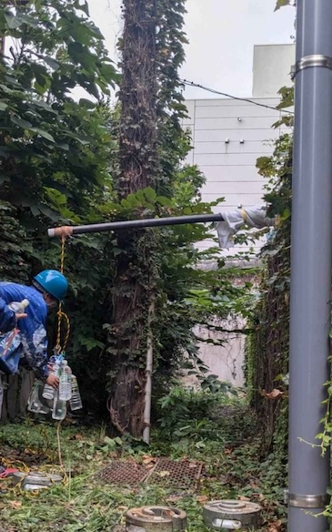
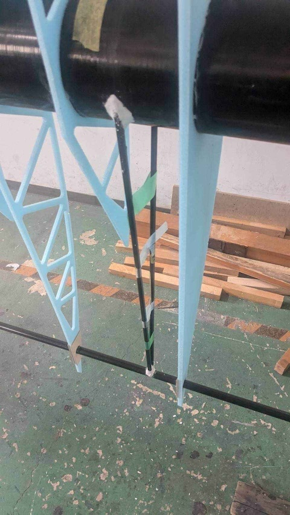
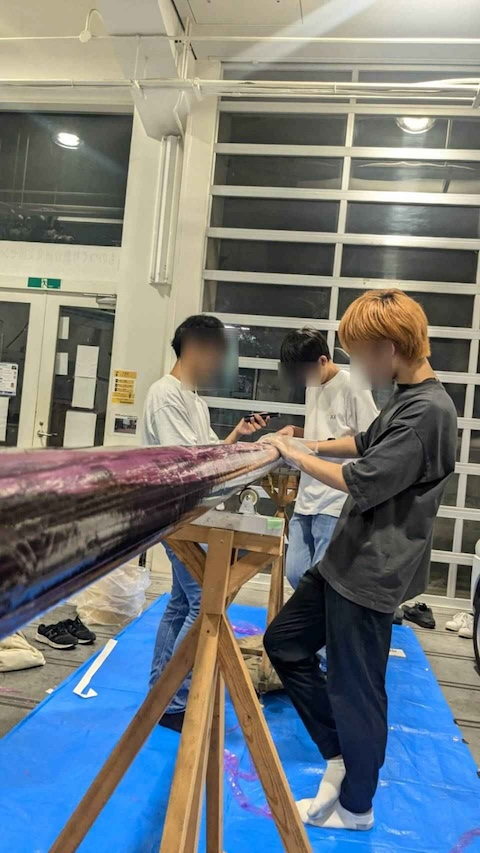
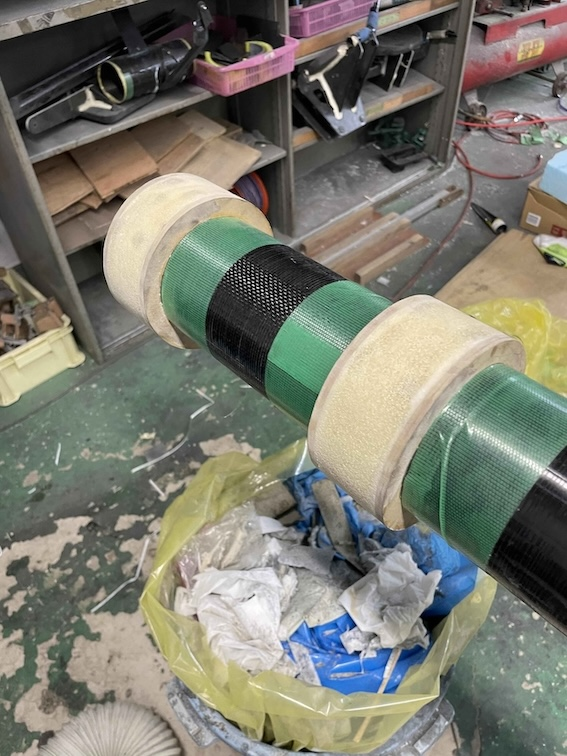
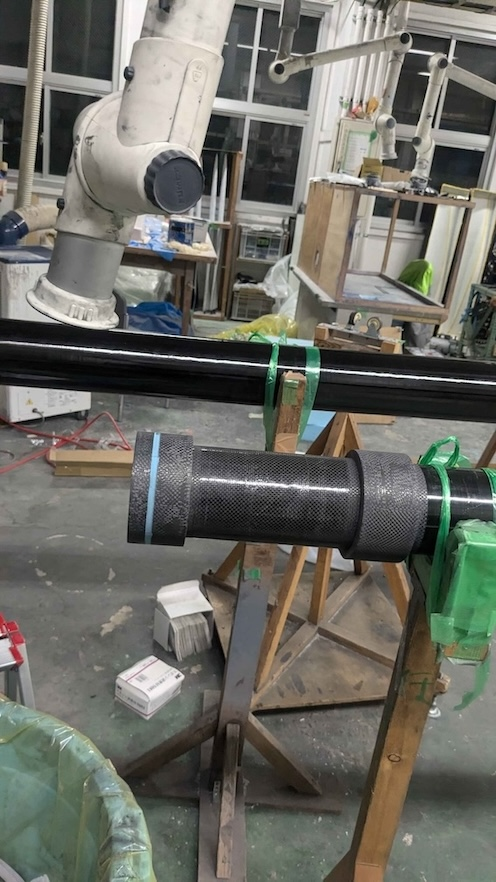
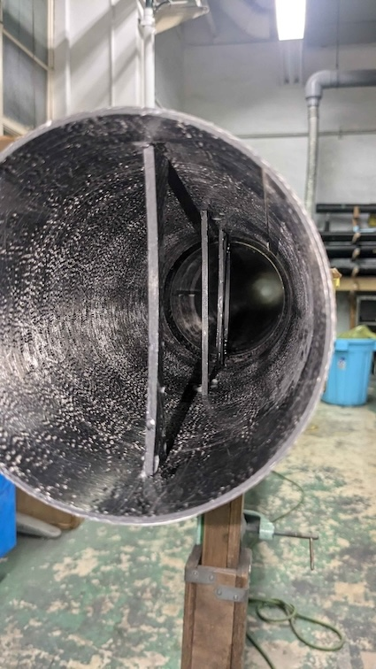
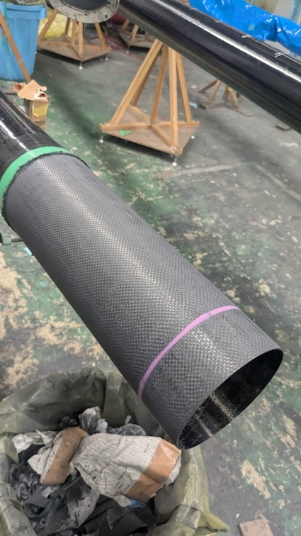
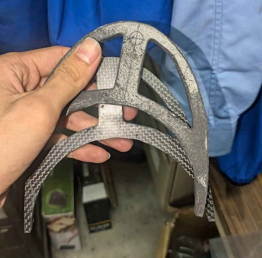

Pフレーム班の活動報告です。(by Pフレーム班主任)

- [8月](#8月)
  - [破壊試験(ピール桁)](#破壊試験ピール桁)
  - [試験翼製作](#試験翼製作)
  - [主翼桁製作(2本)](#主翼桁製作2本)
  - [かんざし製作](#かんざし製作)
- [9月](#9月)
  - [主翼桁製作(3本)、フレーム桁(2本)](#主翼桁製作3本フレーム桁2本)
  - [かんざし製作](#かんざし製作-1)
  - [接マンやすり](#接マンやすり)
  - [翼胴マウント製作(胴体側)](#翼胴マウント製作胴体側)
- [最後に](#最後に)

## 8月

### 破壊試験(ピール桁)

フレーム桁にピール桁を採用するかどうかを決めるために、ピール桁と非ピール桁を用意して破壊試験をしました。そのためのかんざしの準備や桁リブの準備も行いました。Meisterでは破壊試験しばらくしていませんでしたが、無事怪我なく安全に終われたのでよかったです。

### 試験翼製作

試験翼用のリアスパー、ストラットを準備し、設置しました。翼班との流れを確認することができました。

### 主翼桁製作(2本)

主翼桁2本を巻きました。26代にとって初めての主翼桁の桁巻きでしたが、とてもうまく巻けていたので感心しました。

### かんざし製作

巻いた桁を製品長にカットしたあと、かんざしのコア部分を製作しました。mdfの大きさを間違えるという大きなミスをしてしまいましたが、班員の頑張りのおかげで無事完成しました。

## 9月

### 主翼桁製作(3本)、フレーム桁(2本)

主翼桁のうち、翼根側の3本を巻きました。1番時間のかかる桁巻きで、とても大変でしたが、部員の協力のおかげで無事に巻き切ることができました。今年はもう巻かなくて済むことを祈るばかりです、、、

### かんざし製作

8月の続きのコア部分製作、オーバーレイ、やすりを行いました。mdfの大きさを間違えなかったかんざしは1週間程度で終わりましたが、mdfの大きさを間違えたかんざしはコア設置からやすり終わりまでで一ヶ月ぐらいかかってしまいました。ですが無事やすり終わることができました。

### 接マンやすり

1番翼根側の翼桁同士の接合部分2箇所に接マンを採用しています。その準備として桁リブ設置、そしてやすりを行いました。夏休み中には終わりませんでしたが、10月頭に片方のやすりが終わりました。

### 翼胴マウント製作(胴体側)

胴体側の翼胴マウントの製作を行いました。かなり慎重にやすらなければいけない作業ですが、26代の班員もミスせずやすってくれました。10月下旬に設置予定です。

## 最後に

以上がPフレーム班の夏休みの活動報告になります。
執行代となり不安な点がたくさんありましたが、班員はもちろん部員全員のおかげでなんとか順調に製作できています。26代の成長も凄まじく、もう安心して作業を任せられるぐらいまでになってくれています。
Pフレーム班の一番の役割は安全な機体を作ることだと思っているので、パイロットが安心して乗れる機体を作れるよう今後も頑張っていきたいと思います。
