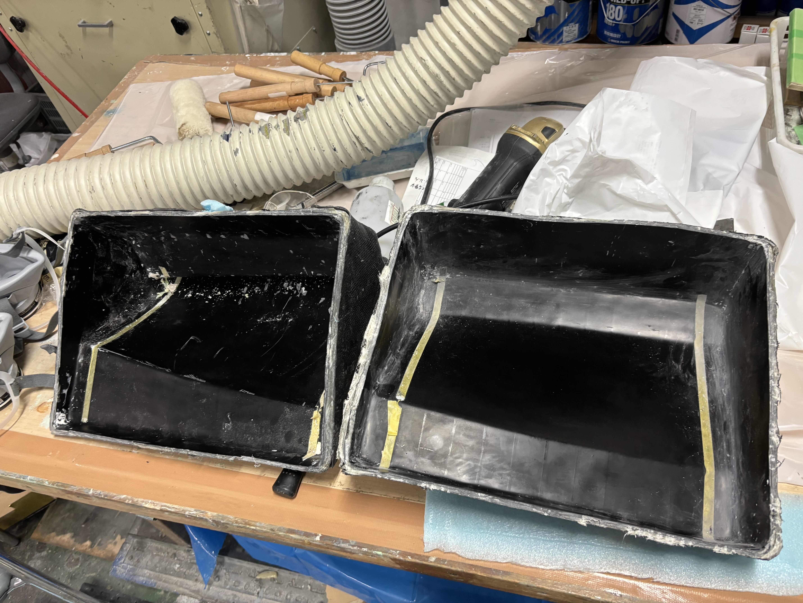

今回はプロペラ班の活動報告です！

## 8月

練習型制作
練習型の土台となるスタイロを台に立てるまで製作を終わらせました。
スタイロを切りすぎてしまったり、レーザーをMDFのボードに通して型が歪んでないかを確認する作業を忘れてしまったりしましたが、なんとか頑張りました。

## 9月

### 練習型制作

240番までのパテを盛りました。
今年は前縁が一体になっている形のupperを作っているため、前縁の部分のパテを石粉粘土に変えてみたり、やすり方を変えてみたりと、制作に苦慮しながら何度か進めてきました。

## 10月

### 練習型制作

240番までのパテを盛り終わったので、サフを吹き、大積層の準備を終わらせました。今年はサフの種類や、サフ前後に除電剤や脱脂剤を塗ってみるなど工夫を重ねました。

### 大積層

大積層は成功とも失敗とも言えない出来でした。人数がやはり多くなく、諸作業がうまくこなせなかったという理由もありましたが、見落としていた点が多く、反省点が多く残るものとなりました。幸い精度に影響は見られなかったのでよかったです。

### 脱型

失敗しました。underは成功したものの、やはり前縁が一体となっている複雑な構造の点をうまく剥がすことができず雌型がボロボロとなってしまいました。本番型では同じ轍を踏まないように工夫します。

### 外皮積層

なんとか作った二つの型で外皮積層を行い、貼り合わせの練習を行いました。前年度より重量を削減するために少ないエポで外皮を作る方法を考え、実行しました。なかなかうまく行ったので、かなりの重量削減が期待できそうです。

