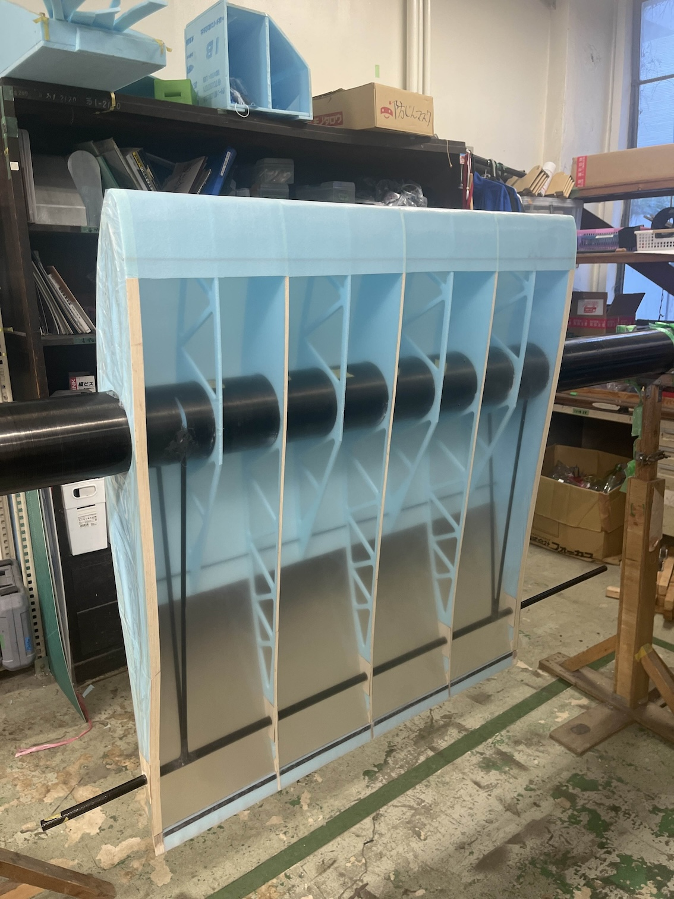
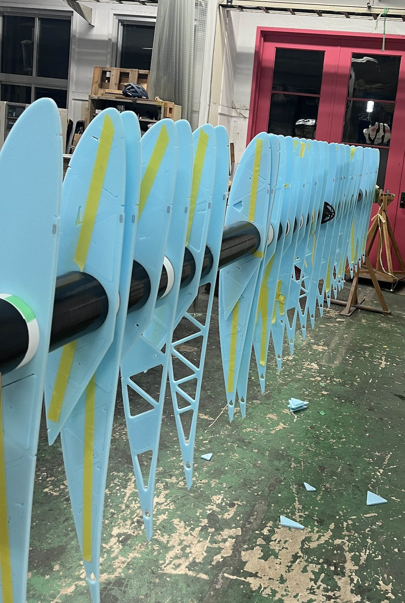

8、9、10月の翼班の作業報告をさせていただきます。(by 翼班主任)

1. [8月、9月](#8月9月)
   1. [フィルム](#フィルム)
   2. [後縁の構造](#後縁の構造)
   3. [ストリンガーの試作](#ストリンガーの試作)
2. [10月](#10月)
   1. [AB翼のリブ切り](#ab翼のリブ切り)
   2. [A翼のリブ立て開始](#a翼のリブ立て開始)

## 8月、9月

8月と9月の夏休み期間は主に本番翼の仕様を決定するための試作を行っていました。
フィルム、後縁の構造、リブ立て方法を決定するために試験翼を計3回ほど製作しました。また、ストリンガーの試作も行いました。

### フィルム

フィルムは数種類のフィルムのサンプルをいただき、簡易的にプランクにフィルムを貼り、熱収縮の度合いなどを検証しました。その結果、昨年度と同じ信越フィルムを採用することになりました。

### 後縁の構造

24代の機体でカーボンリブキャップが熱収縮時のフィルムのテンションに耐え切れず浮いてしまったということがあったため、この問題を改善すべく、バルサリブキャップへの変更を試みることとなりました。
バルサリブキャップへの変更に伴い、後縁の構造を今までの構造から変える必要が出てきたため、その試作も行いました

### ストリンガーの試作

Meisterのストリンガーは、スタイロを1plyカーボンで挟んだ構造になっており、スプレー糊で接着しています。以前より、そのストリンガーがやわらかすぎることが問題となっていました。25代では、用いる材料、糊は変えず、半硬化時間、糊の量、おもりの重さ（接着後おもりを乗せて数日間放置します）などの条件を変え、より良いストリンガーができる条件を探しました。結果、以前よりも高確率で良いストリンガーができる条件が得られましたが、失敗作のストリンガーができてしまうこともあります。

9月最終週には本番翼のマスターを切り始めました。マスターはゴールデンボードをレーザー加工機で切って作っています。今年のマスターはレーザーで焼けてしまう分を考慮し、マスターをオフセットしてから、レーザー加工機で切り出しました。ただ、その日の湿度や材料の質によっても切れ具合などが変わってくるので、なかなか難しいです。

## 10月

本格的に本番翼の製作に入りました。

### AB翼のリブ切り

Meisterでは最も内側の翼をA、そこから外に行く方向に順にB、C、Dと呼んでいます。（さらに、右のBならBR、左のBならBLと呼んでいます。）A、Bのリブ切りはほとんど終わらせることができました。

### A翼のリブ立て開始

Aの大部分のリブ立てを終わらせることができました。試験翼のときと同様の方法で行ったのですが、思ったよりも時間がかかったことや精度の面から新しい方法を考え始めました。そのための試作も行いました。

以上が翼班の8、9、10月の活動報告になります。
作業量が昨年より増え、かなりタイトなスケジュールとなっており、土日を含めほぼ毎日作業に励んでおります。班員全員で協力し、より良い翼を作れるようこれからも頑張っていきますので、今後とも応援のほどよろしくお願いいたします。
