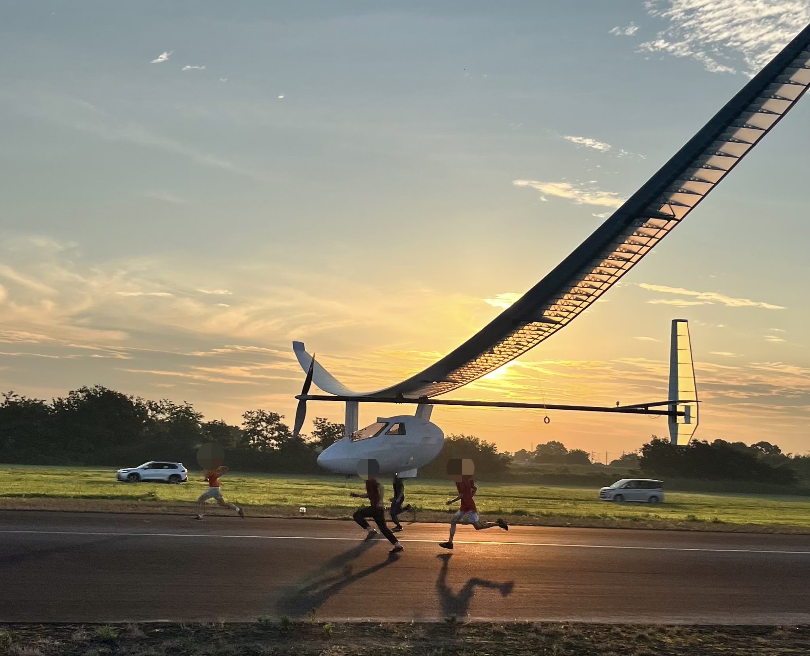

<!DOCTYPE html>
<html lang="ja">
<head>
  <meta charset="UTF-8">
  <meta name="viewport" content="width=device-width, initial-scale=1.0">
  <title>特設ページ</title>
  
</head>
<body>

  

    GIVINGCAMNPAIGN特設サイトです。 
    票数に応じて飛行距離が伸びるよ！
  

  

    
    
    <h1>現在の飛行距離</h1>
    
0m

  

</body>
</html>
